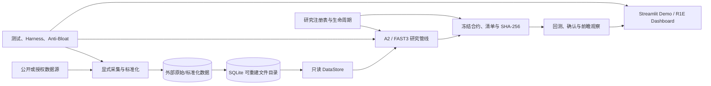
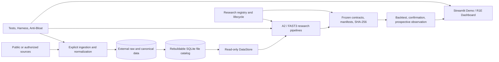
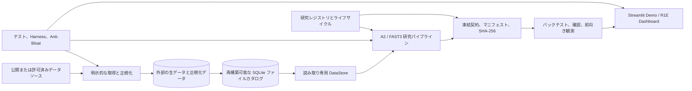

# US Tech Quant v21

Point-in-time US equity research, portfolio simulation, risk analysis, and auditable research infrastructure.

[中文](#中文) · [English](#english) · [日本語](#日本語)

> **Research-only system.** A ranking, backtest, dashboard, service, or forward observation does not authorize live trading, broker execution, model promotion, or investment decisions.

---

## 中文

### 1. 系统定位

US Tech Quant v21 是一个强调**时间点一致性、可复现性、数据血缘与失败关闭**的美股量化研究系统。它不是单一策略脚本，而是由数据控制面、研究身份管理、A2/FAST3 研究管线、组合与风险评估、运行服务和只读展示层组成的工程体系。

仓库只保存代码、小型配置、合约、清单和测试。行情、财报、13F、缓存、模型、日次状态、回测与审计证据位于仓库外部。`V22.xxx`、`A2`、`FAST3` 是内部管线或研究修订标识；项目公开名称仍为 **US Tech Quant v21**。

### 2. 技术架构



| 子系统 | 主要实现 | 技术职责 |
| --- | --- | --- |
| 路径与存储 | `scripts/common/storage_paths.py`, `.ps1` | 解析外部根目录，拒绝仓库内输出和根目录互相嵌套 |
| 数据目录与读取 | `scripts/storage/storage_r2a.py` | 只读 SQLite 目录、Parquet 选择、列/日期过滤、来源校验 |
| 数据刷新 | `scripts/storage/refresh_*.py` | 按来源显式 plan/execute；网络与写入不属于普通测试 |
| 研究身份 | `research_registry.py`, `config/research_registry.json` | 防止同一经济假设通过改名重复计数 |
| 研究生命周期 | `prospective_research_lifecycle.py` | 记录探索、冻结、确认、前瞻观察和结果状态 |
| A2 研究 | `scripts/research/a2/`, `scripts/v22/abcde_a2_*` | Alpha、风险、组合翻译、执行和研究治理 |
| FAST3–FAST6 | `fast3/`–`fast6/` | 带独立状态、注册表、合约和测试的受约束研究系列 |
| 运行与服务 | `scripts/v22/` | 当前日次入口、R1D/R1E 服务、Dashboard 与兼容组件 |
| 展示层 | `apps/demo_console/` | 对冻结历史产物的只读 Streamlit 演示与证据浏览 |

### 3. 数据层与 PIT 合约

运行路径按以下优先级解析：**显式参数 → `USTQ_*` 环境变量 → `config/storage_paths.json` → 内置默认值**。解析器要求各外部根目录彼此独立，且不得位于仓库内部或包含仓库。

| 用途 | 默认位置 | 写入策略 |
| --- | --- | --- |
| 代码与控制面 | `D:\us-tech-quant` | Git 管理 |
| 权威数据 | `D:\us-tech-quant-data` | 默认只读 |
| 可重建缓存 | `D:\us-tech-quant-cache` | 受生命周期管理 |
| 每日状态 | `D:\us-tech-quant-daily` | 活跃运行状态 |
| 回测产物 | `D:\us-tech-quant-backtests` | 研究证据 |
| 结果与审计 | `D:\us-tech-quant-results` | 保留，不做宽泛清理 |
| Python 环境 | `D:\us-tech-quant-envs` | 仓库外隔离 |

`DataStore` 的关键约束：

- 目录默认位于 `cache_root/derived/data_catalog/catalog.sqlite3`，以 SQLite 只读模式打开。
- `dataset + ticker + adjustment` 只能存在一个 `is_current=1` 的文件；歧义立即失败。
- 目录路径必须是绝对路径，并且必须落在已配置的数据/产物根目录内。
- 只接受 Parquet 或显式 Parquet manifest；通过 PyArrow scanner 下推日期、ticker 和列过滤。
- `raw` 与 `qfq`、不同 provider 必须显式区分。默认 Moomoo 读取不会静默回退到其他来源。
- 共享原始输入清单是不可递归的叶子列表；角色、provider、日期顺序、时区、索引和 SHA-256 都会校验。
- “目录当前版本”只表示目录选择结果，不自动证明历史完整性、PIT 合法性或研究采纳状态。
- event date、披露可用时间、数据库 vintage、复权版本和交易 session 是不同概念，不能互相替代。

环境变量包括 `USTQ_REPO_ROOT`、`USTQ_DATA_ROOT`、`USTQ_CACHE_ROOT`、`USTQ_DAILY_ROOT`、`USTQ_BACKTEST_ROOT`、`USTQ_RESULTS_ROOT`、`USTQ_ENVS_ROOT` 和 `USTQ_PYTHON_EXE`。

### 4. 研究生命周期与防泄漏设计

```text
研究身份检查 → 探索 → 候选冻结 → 独立确认 → 前瞻观察 → 保留结论与证据
```

- 研究身份由经济假设、信息集、目标/周期、机制和评估设计共同确定，而不是由文件名决定。
- 缺失值处理、缩放、降维、特征、超参数、模型、阈值、股票池、行业约束、持有期、成本与执行假设都必须服从 fold cutoff。
- 标签成熟时间越过 fold 边界的样本不可进入该 fold。
- 确认前必须冻结候选、数据范围、基准、主要指标、成本、执行、评估方法和停止条件。
- 查看结果后修改冻结条件，会失去原独立检验声明并形成新的探索决策。
- 训练、拟合、校准和选择原则上仅使用 `< 2026-01-01` 的信息；2026+ A2 证据是已暴露的评估数据，不能重新包装为未见留出集。
- 负结果、无增量价值和不可检验结果都是完整研究结论，必须保留，而不是只记录赢家。
- 缺少 PIT 血缘、时间戳、修订身份或成熟度证据时，依赖结论必须失败关闭。

### 5. 安装、检查与运行

依赖版本锁定在 `requirements.lock.txt`。标准运行时为：

```powershell
D:\us-tech-quant-envs\us-tech-quant-main\Scripts\python.exe
```

查看存储和数据目录状态（只读）：

```powershell
Set-Location D:\us-tech-quant
& D:\us-tech-quant-envs\us-tech-quant-main\Scripts\python.exe -B -m scripts.storage.manage_data status
```

启动只读 Demo：

```powershell
& .\apps\demo_console\start.ps1 -Port 8504
```

打开 <http://127.0.0.1:8504/?language=%E4%B8%AD%E6%96%87>。Demo 展示冻结的历史研究记录、排名、持仓变化、收益、回撤、成本和来源证据；不会训练模型、重新运行策略、连接券商或写入权威数据。

默认测试：

```powershell
& D:\us-tech-quant-envs\us-tech-quant-main\Scripts\python.exe -B -m pytest -q
```

`pytest.ini` 精确列出已审阅的存储、维护、preflight 和 R1D/R1E 合成测试。它不是全仓库测试；不要用 `pytest .` 代替，因为部分历史测试会导入真实研究脚本或访问外部证据。

独立代码范围的只读预检：

```powershell
& D:\us-tech-quant-envs\us-tech-quant-main\Scripts\python.exe -B scripts\maintenance\harness_preflight.py --task-scope independent-code --json
```

当前日次研究入口是 `scripts/v22/run_v22_044_daily_single_entrypoint_freeze_and_guard_r1.ps1`，其指针链为 V22.044 → V22.040 → 保留的 V21 组件。`-Execute` 会运行真实数据依赖流程，不是安装或测试命令。

R1E 服务与 Dashboard V2 使用 `start_v22_047_r1e_service.ps1`、`start_v22_047_r1e_ui.ps1`、`status_v22_047_r1e_service.ps1` 和 `stop_v22_047_r1e_service.ps1`。真实服务可能接触 provider/account 表面，必须在单独授权和配置下启动。

### 6. 仓库治理

仓库体积首选上限为 150 MiB，强制上限为 300 MiB；500 MiB 触发硬失败。虚拟环境、大型 Parquet、模型、预测、缓存和生成结果不得提交。Anti-Bloat 的 legacy baseline 同时绑定相对路径、SHA-256 和规则，修改后的旧文件会重新进入当前规则检查。

根目录中部分长文件名、配套测试和 PowerShell 启动器被现有合约绑定了精确路径或内容哈希。移动或改名会破坏冻结身份、注册表或兼容入口，因此暂时保留。新代码应进入对应的 `scripts/`、`tests/` 或研究目录。详见 [`ROOT_AUTHORITY.md`](ROOT_AUTHORITY.md)。

进一步阅读：[`项目地图`](docs/PROJECT_MAP.md) · [`数据层`](docs/DATA_LAYER.md) · [`存储布局`](docs/STORAGE_LAYOUT.md) · [`Anti-Bloat`](docs/governance/ANTI_BLOAT_POLICY.md) · [`Demo 技术说明`](apps/demo_console/README.md)

---

## English

### 1. System scope

US Tech Quant v21 is a US equity research system built around **point-in-time correctness, reproducibility, lineage, and fail-closed behavior**. It is not a single strategy script. It combines a data control plane, research identity management, A2/FAST3 pipelines, portfolio and risk evaluation, runtime services, and a read-only presentation layer.

The repository stores code, compact configuration, contracts, manifests, and tests. Market data, filings, 13F data, caches, models, daily state, backtests, and audit evidence remain external. `V22.xxx`, `A2`, and `FAST3` identify internal revisions; the public name remains **US Tech Quant v21**.

### 2. Technical architecture



| Subsystem | Primary implementation | Responsibility |
| --- | --- | --- |
| Paths and storage | `scripts/common/storage_paths.py`, `.ps1` | Resolve external roots; reject repository-local or nested runtime roots |
| Catalog and reads | `scripts/storage/storage_r2a.py` | Read-only SQLite catalog, Parquet selection, filtered scans, lineage validation |
| Acquisition | `scripts/storage/refresh_*.py` | Source-specific explicit plan/execute workflows; never an implicit test action |
| Research identity | `research_registry.py`, `config/research_registry.json` | Prevent renaming the same economic hypothesis into a fresh trial |
| Research lifecycle | `prospective_research_lifecycle.py` | Record exploration, freeze, confirmation, prospective observation, and outcomes |
| A2 research | `scripts/research/a2/`, `scripts/v22/abcde_a2_*` | Alpha, risk, portfolio translation, execution, and governance |
| FAST3–FAST6 | `fast3/`–`fast6/` | Bounded research families with independent state, registries, contracts, and tests |
| Runtime services | `scripts/v22/` | Current daily chain, R1D/R1E services, Dashboard, compatibility components |
| Presentation | `apps/demo_console/` | Read-only Streamlit views over frozen historical artifacts |

### 3. Data plane and PIT contract

Runtime paths resolve in this order: **explicit override → `USTQ_*` environment variable → `config/storage_paths.json` → built-in default**. Validation requires every external root to be distinct and prevents any root from nesting the repository or another runtime root.

| Purpose | Default location | Posture |
| --- | --- | --- |
| Code and control plane | `D:\us-tech-quant` | Git-managed |
| Canonical data | `D:\us-tech-quant-data` | Read-only by default |
| Rebuildable cache | `D:\us-tech-quant-cache` | Lifecycle-managed |
| Daily state | `D:\us-tech-quant-daily` | Active runtime state |
| Backtests | `D:\us-tech-quant-backtests` | Research evidence |
| Results and audits | `D:\us-tech-quant-results` | Preserved; no broad cleanup |
| Python environments | `D:\us-tech-quant-envs` | Isolated from Git |

Key `DataStore` guarantees:

- The default catalog is `cache_root/derived/data_catalog/catalog.sqlite3` and is opened in SQLite read-only mode.
- At most one `is_current=1` row may exist for a `dataset + ticker + adjustment` key; ambiguity fails immediately.
- Catalog paths must be absolute and remain inside configured data/artifact roots.
- Only Parquet or an explicit Parquet manifest is accepted. Date, ticker, and column selection are pushed into the PyArrow scanner.
- `raw` versus `qfq` and each provider are explicit choices. The Moomoo default never silently falls back to another source.
- Shared raw-input manifests are immutable, nonrecursive leaf lists; role, provider, date ordering, timezone, indexes, and SHA-256 are validated.
- “Current” means selected by the rebuildable catalog. It does not prove complete history, PIT eligibility, or research adoption.
- Event date, disclosure availability, database vintage, adjustment vintage, and trading session are separate contracts.

Supported overrides include `USTQ_REPO_ROOT`, `USTQ_DATA_ROOT`, `USTQ_CACHE_ROOT`, `USTQ_DAILY_ROOT`, `USTQ_BACKTEST_ROOT`, `USTQ_RESULTS_ROOT`, `USTQ_ENVS_ROOT`, and `USTQ_PYTHON_EXE`.

### 4. Research lifecycle and leakage controls

```text
Identity check → Exploration → Candidate freeze → Independent confirmation → Prospective observation → Preserve outcome
```

- Identity is defined by economic hypothesis, available information, target/horizon, mechanism, and evaluation design—not filename.
- Imputation, scaling, dimensionality reduction, features, hyperparameters, models, thresholds, stock pools, sector constraints, holding periods, costs, and execution assumptions all obey fold cutoffs.
- An observation whose label matures outside its fold is ineligible for that fold.
- Before confirmation, freeze the candidate, data/time scope, benchmark, primary metric, cost/execution assumptions, evaluation method, and stopping conditions.
- Changing a frozen choice after outcome access creates a new exploratory decision and forfeits the original independent-test claim.
- Training, fitting, calibration, and selection normally use information from `< 2026-01-01`. A2 evidence from 2026 onward is already exposed evaluation data and cannot become a pristine holdout again.
- Negative, non-incremental, and untestable outcomes are complete results; the system preserves them rather than logging winners only.
- Missing PIT lineage, availability, revision identity, or maturity evidence causes dependent work to fail closed.

### 5. Setup, inspection, and runtime

Dependencies are pinned in `requirements.lock.txt`. The canonical runtime is:

```powershell
D:\us-tech-quant-envs\us-tech-quant-main\Scripts\python.exe
```

Inspect storage and catalog metadata without acquisition:

```powershell
Set-Location D:\us-tech-quant
& D:\us-tech-quant-envs\us-tech-quant-main\Scripts\python.exe -B -m scripts.storage.manage_data status
```

Start the read-only demo:

```powershell
& .\apps\demo_console\start.ps1 -Port 8504
```

Open <http://127.0.0.1:8504/?language=English>. The demo presents frozen historical records, ranks, holdings transitions, returns, drawdowns, costs, and provenance. It does not train models, rerun strategies, connect to a broker, or modify authoritative data.

Run the reviewed default regression suite:

```powershell
& D:\us-tech-quant-envs\us-tech-quant-main\Scripts\python.exe -B -m pytest -q
```

`pytest.ini` enumerates reviewed storage, maintenance, preflight, and synthetic R1D/R1E service tests. It is deliberately not full-repository coverage. Do not substitute `pytest .`: some historical tests import real research stages or access external evidence.

Run the read-only independent-code preflight:

```powershell
& D:\us-tech-quant-envs\us-tech-quant-main\Scripts\python.exe -B scripts\maintenance\harness_preflight.py --task-scope independent-code --json
```

The current daily research entrypoint is `scripts/v22/run_v22_044_daily_single_entrypoint_freeze_and_guard_r1.ps1`, with the pointer chain V22.044 → V22.040 → retained V21 components. `-Execute` runs a real data-dependent workflow; it is not an installation or test command.

R1E service and Dashboard V2 use `start_v22_047_r1e_service.ps1`, `start_v22_047_r1e_ui.ps1`, `status_v22_047_r1e_service.ps1`, and `stop_v22_047_r1e_service.ps1`. Real service startup may touch provider/account surfaces and requires separate authorization and configuration.

### 6. Repository governance

The preferred repository budget is 150 MiB, the required maximum is 300 MiB, and 500 MiB is a hard failure. Virtual environments, bulk Parquet, models, predictions, caches, and generated results stay outside Git. The Anti-Bloat legacy baseline binds repository-relative path, SHA-256, and violation rule; modified legacy files re-enter current enforcement.

Some long root-level Python files, paired tests, and PowerShell launchers are bound to exact paths or content hashes by existing contracts. Moving them would break frozen identities, registry records, or compatibility entrypoints. New code belongs under the relevant `scripts/`, `tests/`, or research directory. See [`ROOT_AUTHORITY.md`](ROOT_AUTHORITY.md).

Read next: [`Project map`](docs/PROJECT_MAP.md) · [`Data layer`](docs/DATA_LAYER.md) · [`Storage layout`](docs/STORAGE_LAYOUT.md) · [`Anti-Bloat policy`](docs/governance/ANTI_BLOAT_POLICY.md) · [`Demo technical guide`](apps/demo_console/README.md)

---

## 日本語

### 1. システムの位置付け

US Tech Quant v21 は、**point-in-time（PIT）整合性、再現性、データ系譜、fail-closed 動作**を中心に設計された米国株式リサーチシステムです。単一の戦略スクリプトではなく、データ制御面、研究識別管理、A2/FAST3 パイプライン、ポートフォリオ／リスク評価、実行サービス、読み取り専用表示層で構成されます。

Git にはコード、小規模設定、契約、マニフェスト、テストのみを保存します。市場データ、開示資料、13F、キャッシュ、モデル、日次状態、バックテスト、監査証拠は外部に置きます。`V22.xxx`、`A2`、`FAST3` は内部リビジョンで、公開名は **US Tech Quant v21** のままです。

### 2. 技術アーキテクチャ



| サブシステム | 主な実装 | 責務 |
| --- | --- | --- |
| パスとストレージ | `scripts/common/storage_paths.py`, `.ps1` | 外部ルート解決、リポジトリ内出力と入れ子を拒否 |
| カタログと読み取り | `scripts/storage/storage_r2a.py` | 読み取り専用 SQLite、Parquet 選択、フィルタ、系譜検証 |
| データ取得 | `scripts/storage/refresh_*.py` | ソース別の明示的 plan/execute。通常テストでは実行しない |
| 研究識別 | `research_registry.py`, `config/research_registry.json` | 同一の経済仮説を改名して新規試行にすることを防止 |
| 研究ライフサイクル | `prospective_research_lifecycle.py` | 探索、凍結、確認、前向き観測、結果を記録 |
| A2 研究 | `scripts/research/a2/`, `scripts/v22/abcde_a2_*` | Alpha、リスク、ポートフォリオ変換、執行、ガバナンス |
| FAST3–FAST6 | `fast3/`–`fast6/` | 独立した状態、レジストリ、契約、テストを持つ研究系列 |
| 実行サービス | `scripts/v22/` | 日次チェーン、R1D/R1E、Dashboard、互換部品 |
| 表示層 | `apps/demo_console/` | 凍結済み履歴成果物の読み取り専用 Streamlit 表示 |

### 3. データ層と PIT 契約

実行パスは **明示的オーバーライド → `USTQ_*` 環境変数 → `config/storage_paths.json` → 内蔵既定値** の順で解決されます。すべての外部ルートは相互に独立し、リポジトリや他のルートを包含できません。

| 用途 | 既定の場所 | 方針 |
| --- | --- | --- |
| コードと制御面 | `D:\us-tech-quant` | Git 管理 |
| 正本データ | `D:\us-tech-quant-data` | 既定で読み取り専用 |
| 再構築可能キャッシュ | `D:\us-tech-quant-cache` | ライフサイクル管理 |
| 日次状態 | `D:\us-tech-quant-daily` | 実行状態 |
| バックテスト | `D:\us-tech-quant-backtests` | 研究証拠 |
| 結果と監査 | `D:\us-tech-quant-results` | 保存対象 |
| Python 環境 | `D:\us-tech-quant-envs` | Git から分離 |

`DataStore` の主要保証：

- 既定カタログは `cache_root/derived/data_catalog/catalog.sqlite3` で、SQLite 読み取り専用モードを使用します。
- `dataset + ticker + adjustment` ごとに `is_current=1` は最大 1 行です。曖昧な場合は即時停止します。
- カタログパスは絶対パスで、設定済みデータ／成果物ルート内に限定されます。
- Parquet または明示的 Parquet manifest のみを受け付け、日付・ticker・列フィルタを PyArrow scanner にプッシュダウンします。
- `raw` / `qfq` と provider は明示的に選択します。Moomoo の既定値は別ソースへ暗黙にフォールバックしません。
- 共有 raw-input manifest は再帰禁止の不変リーフ一覧です。role、provider、日付順、タイムゾーン、index、SHA-256 を検証します。
- カタログ上の「current」は選択結果であり、完全な履歴、PIT 適格性、研究採用を保証しません。
- event date、開示利用可能時刻、database vintage、復権 vintage、取引 session は別々の契約です。

利用可能な上書き変数は `USTQ_REPO_ROOT`、`USTQ_DATA_ROOT`、`USTQ_CACHE_ROOT`、`USTQ_DAILY_ROOT`、`USTQ_BACKTEST_ROOT`、`USTQ_RESULTS_ROOT`、`USTQ_ENVS_ROOT`、`USTQ_PYTHON_EXE` です。

### 4. 研究ライフサイクルとリーク防止

```text
識別確認 → 探索 → 候補凍結 → 独立確認 → 前向き観測 → 結果と証拠を保存
```

- 研究の同一性はファイル名ではなく、経済仮説、情報集合、目的／期間、メカニズム、評価設計で決まります。
- 欠損処理、スケーリング、次元削減、特徴量、ハイパーパラメータ、モデル、閾値、銘柄集合、セクター制約、保有期間、コスト、執行仮定はすべて fold cutoff に従います。
- ラベル成熟時刻が fold 境界を越える観測は、その fold では使用できません。
- 確認前に候補、データ／時刻範囲、ベンチマーク、主要指標、コスト／執行仮定、評価方法、停止条件を凍結します。
- 結果閲覧後の変更は新しい探索判断となり、元の独立検定主張を失います。
- 学習、フィッティング、校正、選択は原則 `< 2026-01-01` の情報を使用します。2026 年以降の A2 証拠は既に公開された評価データで、未観測 holdout には戻せません。
- 否定的、追加価値なし、検証不能な結果も完全な研究成果として保存します。
- PIT 系譜、利用可能時刻、改訂識別、成熟度が不足する場合、依存処理は fail closed します。

### 5. セットアップ、確認、実行

依存関係は `requirements.lock.txt` に固定されています。標準ランタイム：

```powershell
D:\us-tech-quant-envs\us-tech-quant-main\Scripts\python.exe
```

取得を行わずにストレージとカタログを確認：

```powershell
Set-Location D:\us-tech-quant
& D:\us-tech-quant-envs\us-tech-quant-main\Scripts\python.exe -B -m scripts.storage.manage_data status
```

読み取り専用 Demo：

```powershell
& .\apps\demo_console\start.ps1 -Port 8504
```

<http://127.0.0.1:8504/?language=%E6%97%A5%E6%9C%AC%E8%AA%9E> を開きます。Demo は凍結済みの履歴、順位、保有変化、リターン、ドローダウン、コスト、出典を表示します。モデル学習、戦略再実行、ブローカー接続、正本データ変更は行いません。

レビュー済み標準回帰テスト：

```powershell
& D:\us-tech-quant-envs\us-tech-quant-main\Scripts\python.exe -B -m pytest -q
```

`pytest.ini` はレビュー済みのストレージ、保守、preflight、合成 R1D/R1E テストを列挙します。全リポジトリテストではありません。`pytest .` に置き換えると、過去のテストが実研究ステージや外部証拠へアクセスする可能性があります。

独立コード向け読み取り専用 preflight：

```powershell
& D:\us-tech-quant-envs\us-tech-quant-main\Scripts\python.exe -B scripts\maintenance\harness_preflight.py --task-scope independent-code --json
```

現在の日次研究入口は `scripts/v22/run_v22_044_daily_single_entrypoint_freeze_and_guard_r1.ps1` で、V22.044 → V22.040 → 維持される V21 部品というチェーンです。`-Execute` は実データ依存処理を動かすため、インストールやテスト用コマンドではありません。

R1E と Dashboard V2 は `start_v22_047_r1e_service.ps1`、`start_v22_047_r1e_ui.ps1`、`status_v22_047_r1e_service.ps1`、`stop_v22_047_r1e_service.ps1` を使用します。実サービス起動は provider/account に接続する可能性があり、別途許可と設定が必要です。

### 6. リポジトリ・ガバナンス

推奨リポジトリ容量は 150 MiB、必須上限は 300 MiB、500 MiB で hard fail です。仮想環境、大規模 Parquet、モデル、予測、キャッシュ、生成結果は Git 外に置きます。Anti-Bloat の legacy baseline は相対パス、SHA-256、違反ルールを結び付け、変更済み legacy ファイルは現行ルールの対象に戻ります。

ルートにある一部の長い Python ファイル名、対応テスト、PowerShell ランチャーは、既存契約によって正確なパスまたは内容ハッシュに固定されています。移動すると凍結識別子、レジストリ、互換入口が壊れます。新規コードは対応する `scripts/`、`tests/`、研究ディレクトリに追加してください。詳細は [`ROOT_AUTHORITY.md`](ROOT_AUTHORITY.md) を参照してください。

関連文書：[`プロジェクトマップ`](docs/PROJECT_MAP.md) · [`データ層`](docs/DATA_LAYER.md) · [`ストレージ構成`](docs/STORAGE_LAYOUT.md) · [`Anti-Bloat`](docs/governance/ANTI_BLOAT_POLICY.md) · [`Demo 技術ガイド`](apps/demo_console/README.md)

---

## Disclaimer

This software is intended for quantitative research and audit. It does not provide financial advice and does not guarantee investment performance.
