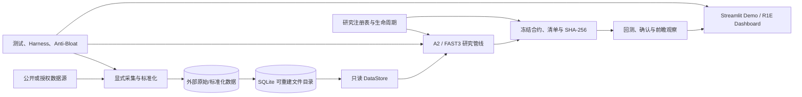
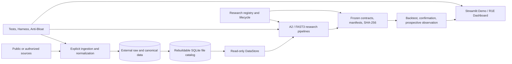
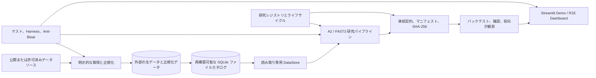

# US Tech Quant v21

Point-in-time US equity research, portfolio simulation, risk analysis, and auditable research infrastructure.

[中文](#中文) · [English](#english) · [日本語](#日本語)

> **Research-only system.** A ranking, backtest, dashboard, service, or forward observation does not authorize live trading, broker execution, model promotion, or investment decisions.

---

## 中文

### 1. 系统定位

US Tech Quant v21 是一个强调**时间点一致性、可复现性、数据血缘与失败关闭**的美股量化研究系统。它不是一组回测 notebook，也不是单一策略脚本，而是一套把“数据何时可知、研究如何冻结、模型如何晋级、服务如何降级、结论如何审计”统一起来的研究操作系统。

仓库只保存代码、小型配置、合约、清单和测试。行情、财报、13F、缓存、模型、日次状态、回测与审计证据位于仓库外部。`V22.xxx`、`A2`、`FAST3` 是内部管线或研究修订标识；项目公开名称仍为 **US Tech Quant v21**。

### 2. 可验证的技术优势

系统的优势不建立在未经复核的收益宣传上，而建立在可以从代码、注册表、合约和测试中逐项核验的工程事实之上。

| 常见薄弱点 | US Tech Quant 的设计 | 失败时行为 |
| --- | --- | --- |
| 只按日期切分，忽略信息真正可用时间 | 区分 event time、披露时间、数据库 vintage、交易 session、标签成熟时间 | PIT 证据不足即停止依赖计算 |
| 通过改文件名重复试验 | 研究身份按经济假设、信息集、目标、机制和评估设计登记 | 命中既有身份时复用/关闭，不重置试验历史 |
| 回测后继续调阈值 | 候选、指标、基准、成本、执行和停止条件在确认前冻结 | 结果后修改自动失去原独立确认含义 |
| “最新文件”覆盖历史来源 | 路径、SHA-256、manifest、vintage 和 catalog selection 分层记录 | 哈希、角色、schema 或来源不一致即拒绝读取 |
| 多数据源静默混用 | provider、`raw`/`qfq`、数据集角色均显式选择 | 不做隐式 fallback，不猜测缺失值 |
| 研究代码直接写入仓库 | 代码与数据、缓存、模型、结果、环境物理分离 | 仓库内产物路径被拒绝，容量门禁失败关闭 |
| 测试误启动真实研究 | `pytest.ini` 使用精确文件白名单，而非全仓库自动发现 | 未审阅历史测试不会进入默认回归 |
| 服务异常后继续显示“正常” | 降级锁存、所有权校验、原子状态写入、受控重启 | 未知状态不自动清除，也不提升授权状态 |
| 仪表盘重新计算或美化结果 | Demo 只读冻结证据，保留缺失值、负分、原始排序和成本口径 | 无证据时明确显示不可用，不生成替代结论 |
| 只保留成功实验 | 注册表和生命周期保留失败、无增量与不可检验结论 | 负结果仍被视为完整研究成果 |

这种设计带来的“优越性”是：结论更难被偶然泄漏、事后选择、版本漂移或运维误判污染；每个重要结论都能追溯到当时可用的信息、冻结身份和验证边界。

### 3. 技术架构



| 子系统 | 主要实现 | 技术职责 |
| --- | --- | --- |
| 路径与存储 | `scripts/common/storage_paths.py`, `.ps1` | 解析外部根目录，拒绝仓库内输出和根目录互相嵌套 |
| 数据目录与读取 | `scripts/storage/storage_r2a.py` | 只读 SQLite 目录、Parquet 选择、列/日期过滤、来源校验 |
| 数据刷新 | `scripts/storage/refresh_*.py` | 按来源显式 plan/execute；网络与写入不属于普通测试 |
| 研究身份 | `research_registry.py`, `config/research_registry.json` | 防止同一经济假设通过改名重复计数 |
| 研究生命周期 | `prospective_research_lifecycle.py` | 记录探索、冻结、确认、前瞻观察和结果状态 |
| A2 研究 | `scripts/research/a2/`, `scripts/v22/abcde_a2_*` | Alpha、风险、组合翻译、执行和研究治理 |
| FAST3–FAST6 | `fast3/`–`fast6/` | 带独立状态、注册表、合约和测试的受约束研究系列 |
| 运行与服务 | `scripts/v22/` | 当前日次入口、R1D/R1E 服务、Dashboard 与兼容组件 |
| 展示层 | `apps/demo_console/` | 对冻结历史产物的只读 Streamlit 演示与证据浏览 |

### 4. 数据层与 PIT 合约

运行路径按以下优先级解析：**显式参数 → `USTQ_*` 环境变量 → `config/storage_paths.json` → 内置默认值**。解析器要求各外部根目录彼此独立，且不得位于仓库内部或包含仓库。

| 用途 | 默认位置 | 写入策略 |
| --- | --- | --- |
| 代码与控制面 | `D:\us-tech-quant` | Git 管理 |
| 权威数据 | `D:\us-tech-quant-data` | 默认只读 |
| 可重建缓存 | `D:\us-tech-quant-cache` | 受生命周期管理 |
| 每日状态 | `D:\us-tech-quant-daily` | 活跃运行状态 |
| 回测产物 | `D:\us-tech-quant-backtests` | 研究证据 |
| 结果与审计 | `D:\us-tech-quant-results` | 保留，不做宽泛清理 |
| Python 环境 | `D:\us-tech-quant-envs` | 仓库外隔离 |

`DataStore` 的关键约束：

- 目录默认位于 `cache_root/derived/data_catalog/catalog.sqlite3`，以 SQLite 只读模式打开。
- `dataset + ticker + adjustment` 只能存在一个 `is_current=1` 的文件；歧义立即失败。
- 目录路径必须是绝对路径，并且必须落在已配置的数据/产物根目录内。
- 只接受 Parquet 或显式 Parquet manifest；通过 PyArrow scanner 下推日期、ticker 和列过滤。
- `raw` 与 `qfq`、不同 provider 必须显式区分。默认 Moomoo 读取不会静默回退到其他来源。
- 共享原始输入清单是不可递归的叶子列表；角色、provider、日期顺序、时区、索引和 SHA-256 都会校验。
- “目录当前版本”只表示目录选择结果，不自动证明历史完整性、PIT 合法性或研究采纳状态。
- event date、披露可用时间、数据库 vintage、复权版本和交易 session 是不同概念，不能互相替代。

环境变量包括 `USTQ_REPO_ROOT`、`USTQ_DATA_ROOT`、`USTQ_CACHE_ROOT`、`USTQ_DAILY_ROOT`、`USTQ_BACKTEST_ROOT`、`USTQ_RESULTS_ROOT`、`USTQ_ENVS_ROOT` 和 `USTQ_PYTHON_EXE`。

### 5. 数据覆盖与标准化边界

仓库提供显式刷新适配器，而不是一个会悄悄联网的统一黑盒。现有接口覆盖：

- 行情与交易日历：日线、分钟线、`raw`/`qfq`、Massive、Moomoo、公开补充来源和交易日历。
- SEC 与公司披露：submissions、company facts、原始事件文档、财务附注、内部人、受益所有权、N-PORT 和 13F。
- 宏观与市场结构：BLS、纽约联储、FRB H.10/G.17、美国财政部、CFTC、FINRA、BIS、VIX 及发布日历。
- 研究派生层：分片 Parquet、不可变输入 manifest、数据质量记录、PIT 13F 重建和显式股票 onboarding。

“存在刷新脚本”不等于“数据已经完整、已获授权或适合某项研究”。采集、标准化、catalog 注册和研究采纳是四个不同状态，必须分别验证。

### 6. 研究生命周期与防泄漏设计

```text
研究身份检查 → 探索 → 候选冻结 → 独立确认 → 前瞻观察 → 保留结论与证据
```

- 研究身份由经济假设、信息集、目标/周期、机制和评估设计共同确定，而不是由文件名决定。
- 缺失值处理、缩放、降维、特征、超参数、模型、阈值、股票池、行业约束、持有期、成本与执行假设都必须服从 fold cutoff。
- 标签成熟时间越过 fold 边界的样本不可进入该 fold。
- 确认前必须冻结候选、数据范围、基准、主要指标、成本、执行、评估方法和停止条件。
- 查看结果后修改冻结条件，会失去原独立检验声明并形成新的探索决策。
- 训练、拟合、校准和选择原则上仅使用 `< 2026-01-01` 的信息；2026+ A2 证据是已暴露的评估数据，不能重新包装为未见留出集。
- 负结果、无增量价值和不可检验结果都是完整研究结论，必须保留，而不是只记录赢家。
- 缺少 PIT 血缘、时间戳、修订身份或成熟度证据时，依赖结论必须失败关闭。

### 7. Alpha、风险、执行与组合分层

A2 不把所有目标塞进一个分数。Alpha、Risk、Execution 使用独立注册表、独立评估口径和独立晋级状态：

- **Alpha 层**负责横截面排序与候选选择，冻结模型和配置身份；模型输出不被解释为概率、权重或收益。
- **Risk 层**处理坏结果不对称性、beta、行业集中度、HHI、尾部损失和风险预算；风险模型按风险任务评估，不能借用 Alpha 指标晋级。
- **Execution 层**处理换手、滞回、成本和组合翻译；固定的 2026 replay 只作为验证元数据，不能冒充 2026 候选选择。
- **Portfolio control 层**连接排名、持仓、行业中性、相对价值、风险约束和执行日期，同时保留每层的原始口径。
- **Champion–challenger 治理**禁止自动晋级；`PROMOTION_ELIGIBLE` 不等于 `PROMOTED_CHAMPION`，晋级需要明确人工授权。

FAST3–FAST6 使用各自状态、阶段注册表和冻结合约。以 FAST3 为例，机器状态明确记录 `IMPLEMENTATION_VALIDATED_SYNTHETIC_ONLY`、`CONFIRMATION_READ_COUNT=0` 和 `LIVE_TRADING_ALLOWED=false`。系统不会把“代码通过合成测试”包装成“经济有效”或“可以实盘”。

### 8. 运行可靠性与安全边界

R1D/R1E 不是简单的常驻脚本。服务层针对 Windows 进程和状态管理验证了：

- 单实例锁、进程所有权、陈旧锁回收及未知 owner 保护；
- 启动前检查不初始化正式输出、不启动 worker、不改变授权状态；
- 断连/重连、取消、崩溃、重启、重复启动和幂等停止；
- 只终止经过验证的自有 worker，拒绝误杀无关 PID；
- 原子 JSON 替换失败时保留原目标，不留下半写状态；
- loopback UI、敏感账户字段拒绝/遮罩、broker mutation 禁止；
- degraded latch 不自动清除，非 ready 状态不得显示为 PASS。

这些测试使用临时仓库、合成桥接器和替代 worker，验证控制面而不触发真实交易。真实 provider/account 连接仍需要单独授权。

### 9. 证据展示而非结果包装

Streamlit Demo 是系统的只读证据控制台，提供中文、英文和日文界面，主要工作区包括：

- System overview：从信息边界、原始得分/排名、持仓变化到执行日期的完整案例链；
- Machine learning：Top20 原始分数、模型配置身份、32 项特征定义和可用/缺失证据边界；
- Decisions & portfolio：持仓矩阵、历史 replay、进出记录、换手和证券轨迹；
- Performance & risk：净/毛收益、成本、月度/年度表现、回撤区间、恢复过程和匹配日期比较；
- Research evidence：来源覆盖、信息/决策/执行日期、artifact 身份、完整哈希和限制说明。

Demo 不重排得分、不把得分转成概率、不填补缺失观测、不把组合回撤归因给单只股票，也不把历史展示解释成独立试验或未来预测。这种“拒绝过度解释”本身就是系统严谨性的一部分。

### 10. 安装、检查与运行

依赖版本锁定在 `requirements.lock.txt`。标准运行时为：

```powershell
D:\us-tech-quant-envs\us-tech-quant-main\Scripts\python.exe
```

查看存储和数据目录状态（只读）：

```powershell
Set-Location D:\us-tech-quant
& D:\us-tech-quant-envs\us-tech-quant-main\Scripts\python.exe -B -m scripts.storage.manage_data status
```

启动只读 Demo：

```powershell
& .\apps\demo_console\start.ps1 -Port 8504
```

打开 <http://127.0.0.1:8504/?language=%E4%B8%AD%E6%96%87>。Demo 展示冻结的历史研究记录、排名、持仓变化、收益、回撤、成本和来源证据；不会训练模型、重新运行策略、连接券商或写入权威数据。

默认测试：

```powershell
& D:\us-tech-quant-envs\us-tech-quant-main\Scripts\python.exe -B -m pytest -q
```

`pytest.ini` 精确列出已审阅的存储、维护、preflight 和 R1D/R1E 合成测试。它不是全仓库测试；不要用 `pytest .` 代替，因为部分历史测试会导入真实研究脚本或访问外部证据。

独立代码范围的只读预检：

```powershell
& D:\us-tech-quant-envs\us-tech-quant-main\Scripts\python.exe -B scripts\maintenance\harness_preflight.py --task-scope independent-code --json
```

当前日次研究入口是 `scripts/v22/run_v22_044_daily_single_entrypoint_freeze_and_guard_r1.ps1`，其指针链为 V22.044 → V22.040 → 保留的 V21 组件。`-Execute` 会运行真实数据依赖流程，不是安装或测试命令。

R1E 服务与 Dashboard V2 使用 `start_v22_047_r1e_service.ps1`、`start_v22_047_r1e_ui.ps1`、`status_v22_047_r1e_service.ps1` 和 `stop_v22_047_r1e_service.ps1`。真实服务可能接触 provider/account 表面，必须在单独授权和配置下启动。

### 11. 仓库治理与状态透明度

仓库体积首选上限为 150 MiB，强制上限为 300 MiB；500 MiB 触发硬失败。虚拟环境、大型 Parquet、模型、预测、缓存和生成结果不得提交。Anti-Bloat 的 legacy baseline 同时绑定相对路径、SHA-256 和规则，修改后的旧文件会重新进入当前规则检查。

根目录中部分长文件名、配套测试和 PowerShell 启动器被现有合约绑定了精确路径或内容哈希。移动或改名会破坏冻结身份、注册表或兼容入口，因此暂时保留。新代码应进入对应的 `scripts/`、`tests/` 或研究目录。详见 [`ROOT_AUTHORITY.md`](ROOT_AUTHORITY.md)。

系统明确区分 `ACTIVE`、`FROZEN`、`EVALUATION_ONLY`、`SUPERSEDED`、`EXPERIMENTAL` 和 `UNKNOWN`。目录版本号、文件新旧和一次测试 PASS 都不能自行改变状态。这里的技术优势不是“永远正确”，而是**不知道时明确标记 UNKNOWN，证据不足时主动停止，状态变化时留下可审计记录**。

核心证据入口：

| 能力 | 实现/状态 | 验证 |
| --- | --- | --- |
| 外部路径隔离 | [`storage_paths.py`](scripts/common/storage_paths.py) | [`test_storage_paths.py`](tests/storage/test_storage_paths.py) |
| 只读 Catalog 与血缘 | [`storage_r2a.py`](scripts/storage/storage_r2a.py) | [`test_data_store.py`](tests/storage/test_data_store.py), [`test_catalog_integration.py`](tests/storage/test_catalog_integration.py) |
| 研究身份与生命周期 | [`research_registry.py`](research_registry.py), [`prospective_research_lifecycle.py`](prospective_research_lifecycle.py) | [`test_research_registry.py`](test_research_registry.py), [`lifecycle tests`](tests/governance/test_prospective_research_lifecycle.py) |
| Alpha/Risk/Execution 治理 | [`alpha`](config/research_governance/alpha_registry.json), [`risk`](config/research_governance/risk_registry.json), [`execution`](config/research_governance/execution_registry.json) | 每个 registry 的模型/config hash 与状态迁移约束 |
| 默认测试隔离 | [`pytest.ini`](pytest.ini) | [`test_default_test_collection.py`](scripts/maintenance/test_default_test_collection.py) |
| R1E 服务加固 | [`service hardening`](scripts/v22/test_v22_047_r1e_windows_service_hardening.py) | 真实入口 + 临时仓库/合成 worker 回归 |
| Demo 证据控制台 | [`技术说明`](apps/demo_console/README.md) | [`Demo tests`](apps/demo_console/tests) |
| FAST3 机器状态 | [`FAST3_STATE.json`](fast3/state/FAST3_STATE.json) | [`FAST3_STATUS.md`](fast3/FAST3_STATUS.md) 与阶段测试 |

进一步阅读：[`项目地图`](docs/PROJECT_MAP.md) · [`数据层`](docs/DATA_LAYER.md) · [`存储布局`](docs/STORAGE_LAYOUT.md) · [`Anti-Bloat`](docs/governance/ANTI_BLOAT_POLICY.md) · [`Demo 技术说明`](apps/demo_console/README.md)

---

## English

### 1. System scope

US Tech Quant v21 is a US equity research system built around **point-in-time correctness, reproducibility, lineage, and fail-closed behavior**. It is not a collection of backtest notebooks or a single strategy script. It is a research operating system that unifies when information became knowable, how a study was frozen, how a model may advance, how a service degrades, and how a conclusion can be audited.

The repository stores code, compact configuration, contracts, manifests, and tests. Market data, filings, 13F data, caches, models, daily state, backtests, and audit evidence remain external. `V22.xxx`, `A2`, and `FAST3` identify internal revisions; the public name remains **US Tech Quant v21**.

### 2. Evidence-backed technical advantages

The system does not claim superiority from unreviewed performance numbers. Its advantages are engineering properties that can be checked in source, registries, contracts, and tests.

| Common weakness | US Tech Quant design | Failure behavior |
| --- | --- | --- |
| Date splits that ignore when information was actually available | Separate event time, disclosure availability, database vintage, trading session, and label maturity | Dependent computation stops when PIT evidence is incomplete |
| Resetting trial history by renaming files | Identity is keyed by hypothesis, information set, target, mechanism, and evaluation design | Existing identities are reused or closed; history is not reset |
| Threshold tuning after seeing the backtest | Candidate, metric, benchmark, costs, execution, and stopping rule freeze before confirmation | Post-outcome changes forfeit the original independent-confirmation claim |
| “Latest file” overwriting provenance | Path, SHA-256, manifest, vintage, and catalog selection are recorded separately | Hash, role, schema, or source mismatch rejects the read |
| Silent mixing of providers or price bases | Provider, `raw`/`qfq`, and dataset role are explicit | No implicit fallback and no invented substitute |
| Research scripts writing artifacts into Git | Code, data, cache, models, results, and environments are physically separated | Repository-local artifact paths and budget violations fail closed |
| Tests accidentally launching real research | `pytest.ini` is an exact reviewed allowlist, not broad discovery | Unreviewed historical tests stay outside the default suite |
| A service showing healthy after an uncertain failure | Degraded latch, ownership checks, atomic state writes, and controlled restart | Unknown state does not auto-clear or increase authorization |
| Dashboards recomputing or beautifying evidence | The demo reads frozen records and preserves missing values, negative scores, original order, and cost basis | Missing evidence remains unavailable; no replacement conclusion is generated |
| Keeping winners only | Registry and lifecycle retain negative, non-incremental, and untestable results | A negative outcome remains a complete research result |

The resulting advantage is contamination resistance: conclusions are harder to distort through leakage, hindsight selection, version drift, or operational ambiguity, and material claims remain traceable to the information, identity, and validation boundary that produced them.

### 3. Technical architecture



| Subsystem | Primary implementation | Responsibility |
| --- | --- | --- |
| Paths and storage | `scripts/common/storage_paths.py`, `.ps1` | Resolve external roots; reject repository-local or nested runtime roots |
| Catalog and reads | `scripts/storage/storage_r2a.py` | Read-only SQLite catalog, Parquet selection, filtered scans, lineage validation |
| Acquisition | `scripts/storage/refresh_*.py` | Source-specific explicit plan/execute workflows; never an implicit test action |
| Research identity | `research_registry.py`, `config/research_registry.json` | Prevent renaming the same economic hypothesis into a fresh trial |
| Research lifecycle | `prospective_research_lifecycle.py` | Record exploration, freeze, confirmation, prospective observation, and outcomes |
| A2 research | `scripts/research/a2/`, `scripts/v22/abcde_a2_*` | Alpha, risk, portfolio translation, execution, and governance |
| FAST3–FAST6 | `fast3/`–`fast6/` | Bounded research families with independent state, registries, contracts, and tests |
| Runtime services | `scripts/v22/` | Current daily chain, R1D/R1E services, Dashboard, compatibility components |
| Presentation | `apps/demo_console/` | Read-only Streamlit views over frozen historical artifacts |

### 4. Data plane and PIT contract

Runtime paths resolve in this order: **explicit override → `USTQ_*` environment variable → `config/storage_paths.json` → built-in default**. Validation requires every external root to be distinct and prevents any root from nesting the repository or another runtime root.

| Purpose | Default location | Posture |
| --- | --- | --- |
| Code and control plane | `D:\us-tech-quant` | Git-managed |
| Canonical data | `D:\us-tech-quant-data` | Read-only by default |
| Rebuildable cache | `D:\us-tech-quant-cache` | Lifecycle-managed |
| Daily state | `D:\us-tech-quant-daily` | Active runtime state |
| Backtests | `D:\us-tech-quant-backtests` | Research evidence |
| Results and audits | `D:\us-tech-quant-results` | Preserved; no broad cleanup |
| Python environments | `D:\us-tech-quant-envs` | Isolated from Git |

Key `DataStore` guarantees:

- The default catalog is `cache_root/derived/data_catalog/catalog.sqlite3` and is opened in SQLite read-only mode.
- At most one `is_current=1` row may exist for a `dataset + ticker + adjustment` key; ambiguity fails immediately.
- Catalog paths must be absolute and remain inside configured data/artifact roots.
- Only Parquet or an explicit Parquet manifest is accepted. Date, ticker, and column selection are pushed into the PyArrow scanner.
- `raw` versus `qfq` and each provider are explicit choices. The Moomoo default never silently falls back to another source.
- Shared raw-input manifests are immutable, nonrecursive leaf lists; role, provider, date ordering, timezone, indexes, and SHA-256 are validated.
- “Current” means selected by the rebuildable catalog. It does not prove complete history, PIT eligibility, or research adoption.
- Event date, disclosure availability, database vintage, adjustment vintage, and trading session are separate contracts.

Supported overrides include `USTQ_REPO_ROOT`, `USTQ_DATA_ROOT`, `USTQ_CACHE_ROOT`, `USTQ_DAILY_ROOT`, `USTQ_BACKTEST_ROOT`, `USTQ_RESULTS_ROOT`, `USTQ_ENVS_ROOT`, and `USTQ_PYTHON_EXE`.

### 5. Data coverage and normalization boundaries

Acquisition is exposed as source-specific adapters, not a single black box that silently accesses the network. Existing adapters cover:

- Market data and calendars: daily and minute bars, `raw`/`qfq`, Massive, Moomoo, public supplemental sources, and trading calendars.
- SEC and company disclosures: submissions, company facts, original event documents, financial notes, insiders, beneficial ownership, N-PORT, and 13F.
- Macro and market structure: BLS, New York Fed, FRB H.10/G.17, US Treasury, CFTC, FINRA, BIS, VIX, and release calendars.
- Research derivatives: partitioned Parquet, immutable input manifests, quality records, PIT 13F reconstruction, and explicit security onboarding.

The existence of an adapter does not mean a dataset is complete, authorized, or suitable for a given study. Acquisition, normalization, catalog registration, and research adoption are four distinct states and must be verified separately.

### 6. Research lifecycle and leakage controls

```text
Identity check → Exploration → Candidate freeze → Independent confirmation → Prospective observation → Preserve outcome
```

- Identity is defined by economic hypothesis, available information, target/horizon, mechanism, and evaluation design—not filename.
- Imputation, scaling, dimensionality reduction, features, hyperparameters, models, thresholds, stock pools, sector constraints, holding periods, costs, and execution assumptions all obey fold cutoffs.
- An observation whose label matures outside its fold is ineligible for that fold.
- Before confirmation, freeze the candidate, data/time scope, benchmark, primary metric, cost/execution assumptions, evaluation method, and stopping conditions.
- Changing a frozen choice after outcome access creates a new exploratory decision and forfeits the original independent-test claim.
- Training, fitting, calibration, and selection normally use information from `< 2026-01-01`. A2 evidence from 2026 onward is already exposed evaluation data and cannot become a pristine holdout again.
- Negative, non-incremental, and untestable outcomes are complete results; the system preserves them rather than logging winners only.
- Missing PIT lineage, availability, revision identity, or maturity evidence causes dependent work to fail closed.

### 7. Layered alpha, risk, execution, and portfolio design

A2 does not collapse every objective into one score. Alpha, Risk, and Execution have separate registries, evaluation criteria, and promotion states:

- The **Alpha layer** owns cross-sectional ranking and candidate selection with frozen model/config identities; model scores are not reinterpreted as probabilities, weights, or returns.
- The **Risk layer** covers bad-outcome asymmetry, beta, sector concentration, HHI, tail loss, and risk budgets. A risk model is judged by risk-family criteria, not promoted with alpha metrics.
- The **Execution layer** handles turnover, hysteresis, cost, and portfolio translation. Fixed 2026 replay is validation metadata, not 2026 candidate selection.
- The **Portfolio-control layer** connects ranks, holdings, sector neutrality, relative value, risk constraints, and execution dates while preserving each layer's original measurement basis.
- **Champion–challenger governance** forbids automatic promotion. `PROMOTION_ELIGIBLE` is not `PROMOTED_CHAMPION`; promotion requires explicit human authorization.

FAST3–FAST6 maintain their own machine state, stage registries, and frozen contracts. FAST3, for example, explicitly reports `IMPLEMENTATION_VALIDATED_SYNTHETIC_ONLY`, `CONFIRMATION_READ_COUNT=0`, and `LIVE_TRADING_ALLOWED=false`. The system does not present “synthetic tests passed” as “economic validity established” or “ready for live trading.”

### 8. Runtime reliability and safety boundary

R1D/R1E is more than a persistent script. Its Windows process and state-control surface verifies:

- single-instance locks, process ownership, stale-lock recovery, and protection of unknown owners;
- prerequisite checks that initialize no formal output, start no workers, and change no authorization state;
- disconnect/reconnect, cancellation, crash, restart, duplicate start, and idempotent stop behavior;
- termination of verified owned workers only, preventing unrelated PID kills;
- atomic JSON replacement that preserves the prior target on write/replace failure;
- loopback-only UI, rejection or masking of sensitive account fields, and prohibition of broker mutation;
- a degraded latch that never auto-clears and non-ready states that never claim PASS.

These tests use temporary repositories, synthetic bridges, and substitute workers to verify the control plane without placing trades. Real provider/account connectivity remains separately authorized.

### 9. Evidence presentation, not result packaging

The Streamlit demo is a read-only evidence console in Chinese, English, and Japanese. Its main workspaces include:

- System overview: a complete case chain from information boundary and original score/rank through membership change and execution date;
- Machine learning: original Top20 scores, model configuration identity, 32 feature definitions, and explicit evidence gaps;
- Decisions & portfolio: holdings matrices, historical replay, entries/exits, turnover, and security trajectories;
- Performance & risk: net/gross paths, costs, monthly/yearly views, drawdown episodes, recovery, and matched-date comparisons;
- Research evidence: source coverage, information/decision/execution dates, artifact identity, full hashes, and limitations.

The demo does not rerank scores, convert scores to probabilities, fill missing observations, attribute portfolio drawdown to one security, or present historical views as independent trials or forecasts. Refusing to over-interpret evidence is itself part of the system's rigor.

### 10. Setup, inspection, and runtime

Dependencies are pinned in `requirements.lock.txt`. The canonical runtime is:

```powershell
D:\us-tech-quant-envs\us-tech-quant-main\Scripts\python.exe
```

Inspect storage and catalog metadata without acquisition:

```powershell
Set-Location D:\us-tech-quant
& D:\us-tech-quant-envs\us-tech-quant-main\Scripts\python.exe -B -m scripts.storage.manage_data status
```

Start the read-only demo:

```powershell
& .\apps\demo_console\start.ps1 -Port 8504
```

Open <http://127.0.0.1:8504/?language=English>. The demo presents frozen historical records, ranks, holdings transitions, returns, drawdowns, costs, and provenance. It does not train models, rerun strategies, connect to a broker, or modify authoritative data.

Run the reviewed default regression suite:

```powershell
& D:\us-tech-quant-envs\us-tech-quant-main\Scripts\python.exe -B -m pytest -q
```

`pytest.ini` enumerates reviewed storage, maintenance, preflight, and synthetic R1D/R1E service tests. It is deliberately not full-repository coverage. Do not substitute `pytest .`: some historical tests import real research stages or access external evidence.

Run the read-only independent-code preflight:

```powershell
& D:\us-tech-quant-envs\us-tech-quant-main\Scripts\python.exe -B scripts\maintenance\harness_preflight.py --task-scope independent-code --json
```

The current daily research entrypoint is `scripts/v22/run_v22_044_daily_single_entrypoint_freeze_and_guard_r1.ps1`, with the pointer chain V22.044 → V22.040 → retained V21 components. `-Execute` runs a real data-dependent workflow; it is not an installation or test command.

R1E service and Dashboard V2 use `start_v22_047_r1e_service.ps1`, `start_v22_047_r1e_ui.ps1`, `status_v22_047_r1e_service.ps1`, and `stop_v22_047_r1e_service.ps1`. Real service startup may touch provider/account surfaces and requires separate authorization and configuration.

### 11. Repository governance and state transparency

The preferred repository budget is 150 MiB, the required maximum is 300 MiB, and 500 MiB is a hard failure. Virtual environments, bulk Parquet, models, predictions, caches, and generated results stay outside Git. The Anti-Bloat legacy baseline binds repository-relative path, SHA-256, and violation rule; modified legacy files re-enter current enforcement.

Some long root-level Python files, paired tests, and PowerShell launchers are bound to exact paths or content hashes by existing contracts. Moving them would break frozen identities, registry records, or compatibility entrypoints. New code belongs under the relevant `scripts/`, `tests/`, or research directory. See [`ROOT_AUTHORITY.md`](ROOT_AUTHORITY.md).

The project distinguishes `ACTIVE`, `FROZEN`, `EVALUATION_ONLY`, `SUPERSEDED`, `EXPERIMENTAL`, and `UNKNOWN`. Directory versions, file age, and one passing test cannot change status by themselves. The technical advantage is not a claim of permanent correctness; it is the discipline to mark unknowns explicitly, stop on insufficient evidence, and leave an auditable record when state changes.

Core evidence index:

| Capability | Implementation/state | Verification |
| --- | --- | --- |
| External path isolation | [`storage_paths.py`](scripts/common/storage_paths.py) | [`test_storage_paths.py`](tests/storage/test_storage_paths.py) |
| Read-only catalog and lineage | [`storage_r2a.py`](scripts/storage/storage_r2a.py) | [`test_data_store.py`](tests/storage/test_data_store.py), [`test_catalog_integration.py`](tests/storage/test_catalog_integration.py) |
| Research identity and lifecycle | [`research_registry.py`](research_registry.py), [`prospective_research_lifecycle.py`](prospective_research_lifecycle.py) | [`test_research_registry.py`](test_research_registry.py), [`lifecycle tests`](tests/governance/test_prospective_research_lifecycle.py) |
| Alpha/Risk/Execution governance | [`alpha`](config/research_governance/alpha_registry.json), [`risk`](config/research_governance/risk_registry.json), [`execution`](config/research_governance/execution_registry.json) | Model/config hashes and state-transition constraints in each registry |
| Default test isolation | [`pytest.ini`](pytest.ini) | [`test_default_test_collection.py`](scripts/maintenance/test_default_test_collection.py) |
| R1E service hardening | [`service hardening`](scripts/v22/test_v22_047_r1e_windows_service_hardening.py) | Real entrypoints exercised with temporary repositories and synthetic workers |
| Demo evidence console | [`technical guide`](apps/demo_console/README.md) | [`Demo tests`](apps/demo_console/tests) |
| FAST3 machine state | [`FAST3_STATE.json`](fast3/state/FAST3_STATE.json) | [`FAST3_STATUS.md`](fast3/FAST3_STATUS.md) and stage tests |

Read next: [`Project map`](docs/PROJECT_MAP.md) · [`Data layer`](docs/DATA_LAYER.md) · [`Storage layout`](docs/STORAGE_LAYOUT.md) · [`Anti-Bloat policy`](docs/governance/ANTI_BLOAT_POLICY.md) · [`Demo technical guide`](apps/demo_console/README.md)

---

## 日本語

### 1. システムの位置付け

US Tech Quant v21 は、**point-in-time（PIT）整合性、再現性、データ系譜、fail-closed 動作**を中心に設計された米国株式リサーチシステムです。バックテスト notebook の集合でも単一戦略スクリプトでもありません。情報がいつ利用可能になったか、研究をどう凍結したか、モデルがどう昇格できるか、サービスがどう縮退するか、結論をどう監査できるかを一体化した研究オペレーティングシステムです。

Git にはコード、小規模設定、契約、マニフェスト、テストのみを保存します。市場データ、開示資料、13F、キャッシュ、モデル、日次状態、バックテスト、監査証拠は外部に置きます。`V22.xxx`、`A2`、`FAST3` は内部リビジョンで、公開名は **US Tech Quant v21** のままです。

### 2. 証拠に基づく技術的優位性

未検証の運用成績を根拠に優位性を主張しません。優位性は、ソース、レジストリ、契約、テストから確認できる工学的事実に基づきます。

| 一般的な弱点 | US Tech Quant の設計 | 失敗時の動作 |
| --- | --- | --- |
| 情報の実際の利用可能時刻を無視した日付分割 | event time、開示時刻、database vintage、session、ラベル成熟を分離 | PIT 証拠不足なら依存計算を停止 |
| ファイル名変更による試行履歴のリセット | 仮説、情報集合、目的、機構、評価設計で研究を識別 | 既存識別を再利用または終了し、履歴をリセットしない |
| バックテスト閲覧後の閾値調整 | 候補、指標、基準、コスト、執行、停止条件を確認前に凍結 | 結果後の変更は元の独立確認主張を失う |
| 「最新ファイル」による系譜上書き | path、SHA-256、manifest、vintage、catalog selection を分離記録 | hash、role、schema、source 不一致なら読み取り拒否 |
| provider や価格基準の暗黙混合 | provider、`raw`/`qfq`、dataset role を明示選択 | 暗黙 fallback や推測値を使用しない |
| 研究スクリプトが Git 内に成果物を生成 | code、data、cache、model、result、environment を物理分離 | リポジトリ内成果物と容量違反を fail closed |
| テストが実研究を誤起動 | `pytest.ini` は広範な探索ではなく、レビュー済みの正確な allowlist | 未レビューの過去テストを標準回帰から除外 |
| 不確実な障害後もサービスが正常表示 | degraded latch、所有権確認、原子的状態書き込み、制御再起動 | 不明状態を自動解除せず、権限を上げない |
| Dashboard が証拠を再計算・美化 | Demo は凍結記録を読み、欠損、負値、元順位、コスト基準を保持 | 証拠不足を明示し、代替結論を生成しない |
| 成功実験のみ保存 | 負、追加価値なし、検証不能の結果もレジストリに保持 | 否定的結果も完全な研究成果として扱う |

この設計の優位性は、リーク、事後選択、バージョンドリフト、運用上の曖昧さによる結論汚染への耐性です。重要な主張は、その時点の情報、凍結識別、検証境界まで追跡できます。

### 3. 技術アーキテクチャ



| サブシステム | 主な実装 | 責務 |
| --- | --- | --- |
| パスとストレージ | `scripts/common/storage_paths.py`, `.ps1` | 外部ルート解決、リポジトリ内出力と入れ子を拒否 |
| カタログと読み取り | `scripts/storage/storage_r2a.py` | 読み取り専用 SQLite、Parquet 選択、フィルタ、系譜検証 |
| データ取得 | `scripts/storage/refresh_*.py` | ソース別の明示的 plan/execute。通常テストでは実行しない |
| 研究識別 | `research_registry.py`, `config/research_registry.json` | 同一の経済仮説を改名して新規試行にすることを防止 |
| 研究ライフサイクル | `prospective_research_lifecycle.py` | 探索、凍結、確認、前向き観測、結果を記録 |
| A2 研究 | `scripts/research/a2/`, `scripts/v22/abcde_a2_*` | Alpha、リスク、ポートフォリオ変換、執行、ガバナンス |
| FAST3–FAST6 | `fast3/`–`fast6/` | 独立した状態、レジストリ、契約、テストを持つ研究系列 |
| 実行サービス | `scripts/v22/` | 日次チェーン、R1D/R1E、Dashboard、互換部品 |
| 表示層 | `apps/demo_console/` | 凍結済み履歴成果物の読み取り専用 Streamlit 表示 |

### 4. データ層と PIT 契約

実行パスは **明示的オーバーライド → `USTQ_*` 環境変数 → `config/storage_paths.json` → 内蔵既定値** の順で解決されます。すべての外部ルートは相互に独立し、リポジトリや他のルートを包含できません。

| 用途 | 既定の場所 | 方針 |
| --- | --- | --- |
| コードと制御面 | `D:\us-tech-quant` | Git 管理 |
| 正本データ | `D:\us-tech-quant-data` | 既定で読み取り専用 |
| 再構築可能キャッシュ | `D:\us-tech-quant-cache` | ライフサイクル管理 |
| 日次状態 | `D:\us-tech-quant-daily` | 実行状態 |
| バックテスト | `D:\us-tech-quant-backtests` | 研究証拠 |
| 結果と監査 | `D:\us-tech-quant-results` | 保存対象 |
| Python 環境 | `D:\us-tech-quant-envs` | Git から分離 |

`DataStore` の主要保証：

- 既定カタログは `cache_root/derived/data_catalog/catalog.sqlite3` で、SQLite 読み取り専用モードを使用します。
- `dataset + ticker + adjustment` ごとに `is_current=1` は最大 1 行です。曖昧な場合は即時停止します。
- カタログパスは絶対パスで、設定済みデータ／成果物ルート内に限定されます。
- Parquet または明示的 Parquet manifest のみを受け付け、日付・ticker・列フィルタを PyArrow scanner にプッシュダウンします。
- `raw` / `qfq` と provider は明示的に選択します。Moomoo の既定値は別ソースへ暗黙にフォールバックしません。
- 共有 raw-input manifest は再帰禁止の不変リーフ一覧です。role、provider、日付順、タイムゾーン、index、SHA-256 を検証します。
- カタログ上の「current」は選択結果であり、完全な履歴、PIT 適格性、研究採用を保証しません。
- event date、開示利用可能時刻、database vintage、復権 vintage、取引 session は別々の契約です。

利用可能な上書き変数は `USTQ_REPO_ROOT`、`USTQ_DATA_ROOT`、`USTQ_CACHE_ROOT`、`USTQ_DAILY_ROOT`、`USTQ_BACKTEST_ROOT`、`USTQ_RESULTS_ROOT`、`USTQ_ENVS_ROOT`、`USTQ_PYTHON_EXE` です。

### 5. データ対象と正規化境界

データ取得は、暗黙にネットワークへ接続する単一ブラックボックスではなく、ソース別の明示的 adapter として提供されます。既存 adapter の対象：

- 市場データとカレンダー：日足、分足、`raw`/`qfq`、Massive、Moomoo、公開補完ソース、取引カレンダー。
- SEC と企業開示：submissions、company facts、原文イベント、財務注記、内部者、実質所有、N-PORT、13F。
- マクロと市場構造：BLS、NY Fed、FRB H.10/G.17、米国財務省、CFTC、FINRA、BIS、VIX、発表カレンダー。
- 研究派生層：partitioned Parquet、不変 input manifest、品質記録、PIT 13F 再構築、明示的 security onboarding。

adapter の存在は、データが完全、許可済み、特定研究に適格であることを意味しません。取得、正規化、catalog 登録、研究採用は別々の状態として検証します。

### 6. 研究ライフサイクルとリーク防止

```text
識別確認 → 探索 → 候補凍結 → 独立確認 → 前向き観測 → 結果と証拠を保存
```

- 研究の同一性はファイル名ではなく、経済仮説、情報集合、目的／期間、メカニズム、評価設計で決まります。
- 欠損処理、スケーリング、次元削減、特徴量、ハイパーパラメータ、モデル、閾値、銘柄集合、セクター制約、保有期間、コスト、執行仮定はすべて fold cutoff に従います。
- ラベル成熟時刻が fold 境界を越える観測は、その fold では使用できません。
- 確認前に候補、データ／時刻範囲、ベンチマーク、主要指標、コスト／執行仮定、評価方法、停止条件を凍結します。
- 結果閲覧後の変更は新しい探索判断となり、元の独立検定主張を失います。
- 学習、フィッティング、校正、選択は原則 `< 2026-01-01` の情報を使用します。2026 年以降の A2 証拠は既に公開された評価データで、未観測 holdout には戻せません。
- 否定的、追加価値なし、検証不能な結果も完全な研究成果として保存します。
- PIT 系譜、利用可能時刻、改訂識別、成熟度が不足する場合、依存処理は fail closed します。

### 7. Alpha・Risk・Execution・Portfolio の分離設計

A2 はすべての目的を一つの score に押し込みません。Alpha、Risk、Execution は独立したレジストリ、評価基準、昇格状態を持ちます。

- **Alpha 層**は横断的ランキングと候補選択を担当し、model/config identity を凍結します。model score を確率、weight、return として再解釈しません。
- **Risk 層**は悪化非対称性、beta、sector concentration、HHI、tail loss、risk budget を扱います。Risk model は risk-family 基準で評価し、Alpha 指標で昇格させません。
- **Execution 層**は turnover、hysteresis、cost、portfolio translation を扱います。固定 2026 replay は検証 metadata であり、2026 candidate selection ではありません。
- **Portfolio-control 層**は順位、保有、sector neutrality、relative value、risk constraint、execution date を接続し、各層の元の測定基準を保持します。
- **Champion–challenger governance** は自動昇格を禁止します。`PROMOTION_ELIGIBLE` は `PROMOTED_CHAMPION` ではなく、昇格には明示的な人手承認が必要です。

FAST3–FAST6 は独自の machine state、stage registry、frozen contract を保持します。FAST3 は `IMPLEMENTATION_VALIDATED_SYNTHETIC_ONLY`、`CONFIRMATION_READ_COUNT=0`、`LIVE_TRADING_ALLOWED=false` を明示します。「合成テスト合格」を「経済的有効性」や「実取引可能」と表現しません。

### 8. 実行信頼性と安全境界

R1D/R1E は単純な常駐スクリプトではありません。Windows の process/state 制御について次を検証します。

- single-instance lock、process ownership、stale lock 回収、unknown owner 保護；
- 正式出力を初期化せず、worker を起動せず、権限状態を変えない prerequisite check；
- disconnect/reconnect、cancel、crash、restart、duplicate start、idempotent stop；
- 検証済みの自所有 worker のみを終了し、無関係 PID の kill を拒否；
- JSON の atomic replace に失敗した場合、既存 target を保持；
- loopback-only UI、機密 account field の拒否／mask、broker mutation の禁止；
- 自動解除されない degraded latch と、non-ready を PASS 表示しない制約。

これらのテストは一時リポジトリ、合成 bridge、代替 worker を用い、実取引を行わずに制御面を検証します。実 provider/account 接続には別途許可が必要です。

### 9. 結果の包装ではなく証拠の提示

Streamlit Demo は中文・English・日本語に対応する読み取り専用 evidence console です。主な workspace：

- System overview：情報境界、元 score/rank、保有変化、execution date までの完全な case chain；
- Machine learning：元 Top20 score、model configuration identity、32 feature definitions、明示的 evidence gap；
- Decisions & portfolio：holdings matrix、historical replay、entry/exit、turnover、security trajectory；
- Performance & risk：net/gross path、cost、月次／年次表示、drawdown episode、recovery、matched-date comparison；
- Research evidence：source coverage、information/decision/execution date、artifact identity、full hash、limitation。

Demo は score の再順位付け、確率への変換、欠損観測の補完、単一銘柄への portfolio drawdown 帰属、履歴表示の独立試行／予測化を行いません。証拠を過剰解釈しないこと自体がシステムの厳密性です。

### 10. セットアップ、確認、実行

依存関係は `requirements.lock.txt` に固定されています。標準ランタイム：

```powershell
D:\us-tech-quant-envs\us-tech-quant-main\Scripts\python.exe
```

取得を行わずにストレージとカタログを確認：

```powershell
Set-Location D:\us-tech-quant
& D:\us-tech-quant-envs\us-tech-quant-main\Scripts\python.exe -B -m scripts.storage.manage_data status
```

読み取り専用 Demo：

```powershell
& .\apps\demo_console\start.ps1 -Port 8504
```

<http://127.0.0.1:8504/?language=%E6%97%A5%E6%9C%AC%E8%AA%9E> を開きます。Demo は凍結済みの履歴、順位、保有変化、リターン、ドローダウン、コスト、出典を表示します。モデル学習、戦略再実行、ブローカー接続、正本データ変更は行いません。

レビュー済み標準回帰テスト：

```powershell
& D:\us-tech-quant-envs\us-tech-quant-main\Scripts\python.exe -B -m pytest -q
```

`pytest.ini` はレビュー済みのストレージ、保守、preflight、合成 R1D/R1E テストを列挙します。全リポジトリテストではありません。`pytest .` に置き換えると、過去のテストが実研究ステージや外部証拠へアクセスする可能性があります。

独立コード向け読み取り専用 preflight：

```powershell
& D:\us-tech-quant-envs\us-tech-quant-main\Scripts\python.exe -B scripts\maintenance\harness_preflight.py --task-scope independent-code --json
```

現在の日次研究入口は `scripts/v22/run_v22_044_daily_single_entrypoint_freeze_and_guard_r1.ps1` で、V22.044 → V22.040 → 維持される V21 部品というチェーンです。`-Execute` は実データ依存処理を動かすため、インストールやテスト用コマンドではありません。

R1E と Dashboard V2 は `start_v22_047_r1e_service.ps1`、`start_v22_047_r1e_ui.ps1`、`status_v22_047_r1e_service.ps1`、`stop_v22_047_r1e_service.ps1` を使用します。実サービス起動は provider/account に接続する可能性があり、別途許可と設定が必要です。

### 11. リポジトリ・ガバナンスと状態透明性

推奨リポジトリ容量は 150 MiB、必須上限は 300 MiB、500 MiB で hard fail です。仮想環境、大規模 Parquet、モデル、予測、キャッシュ、生成結果は Git 外に置きます。Anti-Bloat の legacy baseline は相対パス、SHA-256、違反ルールを結び付け、変更済み legacy ファイルは現行ルールの対象に戻ります。

ルートにある一部の長い Python ファイル名、対応テスト、PowerShell ランチャーは、既存契約によって正確なパスまたは内容ハッシュに固定されています。移動すると凍結識別子、レジストリ、互換入口が壊れます。新規コードは対応する `scripts/`、`tests/`、研究ディレクトリに追加してください。詳細は [`ROOT_AUTHORITY.md`](ROOT_AUTHORITY.md) を参照してください。

プロジェクトは `ACTIVE`、`FROZEN`、`EVALUATION_ONLY`、`SUPERSEDED`、`EXPERIMENTAL`、`UNKNOWN` を区別します。directory version、file age、一回の test PASS だけでは状態を変更できません。技術的優位性は「常に正しい」という主張ではなく、未知を明示し、証拠不足で停止し、状態変更を監査可能な記録として残す規律です。

主要証拠インデックス：

| 能力 | 実装／状態 | 検証 |
| --- | --- | --- |
| 外部 path 分離 | [`storage_paths.py`](scripts/common/storage_paths.py) | [`test_storage_paths.py`](tests/storage/test_storage_paths.py) |
| 読み取り専用 catalog と lineage | [`storage_r2a.py`](scripts/storage/storage_r2a.py) | [`test_data_store.py`](tests/storage/test_data_store.py), [`test_catalog_integration.py`](tests/storage/test_catalog_integration.py) |
| 研究 identity と lifecycle | [`research_registry.py`](research_registry.py), [`prospective_research_lifecycle.py`](prospective_research_lifecycle.py) | [`test_research_registry.py`](test_research_registry.py), [`lifecycle tests`](tests/governance/test_prospective_research_lifecycle.py) |
| Alpha/Risk/Execution governance | [`alpha`](config/research_governance/alpha_registry.json), [`risk`](config/research_governance/risk_registry.json), [`execution`](config/research_governance/execution_registry.json) | 各 registry の model/config hash と state-transition 制約 |
| 標準 test 分離 | [`pytest.ini`](pytest.ini) | [`test_default_test_collection.py`](scripts/maintenance/test_default_test_collection.py) |
| R1E service hardening | [`service hardening`](scripts/v22/test_v22_047_r1e_windows_service_hardening.py) | 一時 repository と synthetic worker で実 entrypoint を検証 |
| Demo evidence console | [`technical guide`](apps/demo_console/README.md) | [`Demo tests`](apps/demo_console/tests) |
| FAST3 machine state | [`FAST3_STATE.json`](fast3/state/FAST3_STATE.json) | [`FAST3_STATUS.md`](fast3/FAST3_STATUS.md) と stage tests |

関連文書：[`プロジェクトマップ`](docs/PROJECT_MAP.md) · [`データ層`](docs/DATA_LAYER.md) · [`ストレージ構成`](docs/STORAGE_LAYOUT.md) · [`Anti-Bloat`](docs/governance/ANTI_BLOAT_POLICY.md) · [`Demo 技術ガイド`](apps/demo_console/README.md)

---

## Disclaimer

This software is intended for quantitative research and audit. It does not provide financial advice and does not guarantee investment performance.
