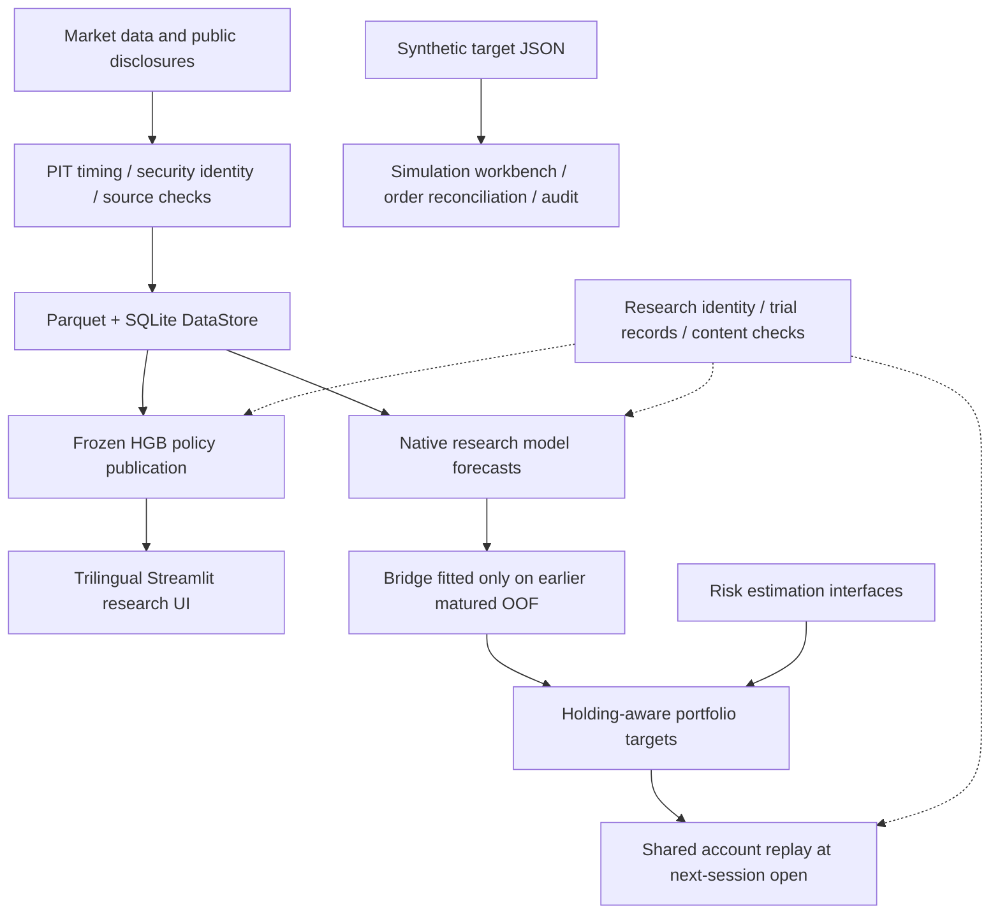

# US Tech Quant v21

**A quantitative research and simulated execution project for U.S. equities.**
It organizes data, forecasts, portfolios, and demos around information availability, retaining source references, time boundaries, and decision records.

[中文](../README.md) · [日本語](README.ja.md) · [English](README.en.md)

[Overview](#overview) · [Architecture](#architecture) · [Engineering](#engineering) · [Research](#research) · [Run the demos](#quickstart) · [Verification](#verification) · [Source guide](#navigation)

> **Current verification:** On 2026-10-01, the default synthetic regression suite reported **203 passed**. This result covers the selected engineering test suite; it does not establish strategy effectiveness or live trading readiness. Full datasets, model artifacts, and research ledgers are stored outside the repository. The public source includes a simulation workbench that runs on synthetic data.

<a id="overview"></a>
## Overview

The challenge in a quantitative project extends beyond the model to the information and execution chain around it: when a filing became public, whether historical security identities are correct, what a prediction actually represents, whether existing holdings can be traded, and whether a failed experiment can be reconstructed.

PIT (point-in-time) means reconstructing inputs from information available at the decision time. OOF (out-of-fold) refers to predictions generated outside each time-based training fold. HGB stands for histogram gradient boosting.

This project implements three groups of capabilities around those questions:

| Capability | Implementation | Inspectable output |
| --- | --- | --- |
| **Data and PIT** | Parquet / SQLite catalog, source and price conventions, 13F disclosure timing and security identity | Data identity, availability timestamps, lineage, and rejection reasons |
| **Research and portfolios** | Native model forecasts, matured OOF bridges, risk matrices, holding-aware portfolios, and shared account replay | Frozen parameters, target weights, costs, and account constraints |
| **Presentation and simulation** | A trilingual Streamlit research UI, a standard-library simulation workbench, order reconciliation, and audit records | Decision chains, position differences, order status, and run records |

The public project name retains **v21**. In the source, `V22`, `A2`, and `FAST3` identify internal pipelines and research series. Research implementations, published policies, and simulation components have distinct statuses; a filename alone does not establish that a model has been adopted.

<a id="architecture"></a>
## Architecture



The diagram shows module responsibilities. **The frozen HGB presentation chain and the JOINT research chain are maintained separately.** Shared account replay uses research price-index units; the simulation workbench has its own state and order lifecycle.

| Layer | Technology | Design focus |
| --- | --- | --- |
| Data | Python, Pandas, NumPy, PyArrow, Parquet, SQLite | Keep source, price adjustment, vintage, and lineage distinct |
| Models | scikit-learn; optional boosting and PyTorch research implementations | Preserve the native meaning of returns, probabilities, ranks, and quantiles |
| Research control | JSON, SHA-256, immutable snapshots, and event hash chains | Duplicate detection, freeze checks, failed trials, and acceptance status |
| Presentation | Streamlit, Altair, Chinese / Japanese / English | Read published artifacts and show dates, gaps, and decision chains |
| Simulation and services | Python standard library, HTML / CSS / JavaScript, SQLite WAL, PowerShell | File locks, persistent state, order reconciliation, and process ownership |

Source, tests, and small configuration files live in the repository. Data, environments, caches, experiments, reports, and daily state are routed to distinct, non-nested external roots through the [shared path configuration](../config/storage_paths.json) and [common resolver](../scripts/common/storage_paths.py). See the [storage guide](STORAGE_LAYOUT.md).

<a id="engineering"></a>
## Three engineering designs worth exploring

### 1. Reconstruct 13F information by availability, not by reporting quarter

The [13F PIT reconstruction module](../scripts/v22/pit_13f_reconstruction_r1.py) selects usable filings from SEC acceptance timestamps, New York decision cutoffs, amendment semantics, and historical security identity. `security_id` / CUSIP and ticker serve different purposes; a ticker alone cannot establish consistent historical identity. Manager rosters are resolved from quarter-effective intervals in the [13F refresh module](../scripts/storage/refresh_13f_quarter.py).

The following is a **synthetic illustration**, not a research observation:

| Scenario | Usable for a decision? | Reason |
| --- | --- | --- |
| Public at 10:20 on 2025-11-12; the decision cutoff is 09:45 that day in New York | No | Disclosure occurred after the decision |
| The same filing is considered for a 09:45 decision on the next trading day | Eligible for further checks | Availability meets the cutoff; identity, amendments, and eligibility must still be valid |
| Only a ticker is available, without reliable historical identity | Block the dependent calculation | A security mapping cannot be fabricated |

**Tradeoff:** Report missing evidence explicitly rather than reconstructing the past from today's mappings or later disclosures.

### 2. Preserve semantics between model predictions and portfolio targets

Probabilities, cross-sectional ranks, return forecasts, and quantiles cannot be treated as interchangeable weights. The [native forecast bridge](../scripts/research/a2/ensemble/joint_oof_bridge.py) preserves each prediction's coordinate system, then fits scaling and a Ridge bridge on **OOF records whose labels had matured before the decision**. Each date receives equal total weight so that dates with more candidates do not dominate the fit.

Frozen inference applies existing parameters only. The corresponding [test definitions](../tests/research/a2/ensemble/test_joint_oof_bridge.py) cover maturity cutoffs, preservation of native coordinates, and checks that appending future records does not alter an earlier fit.

**Tradeoff:** Models can be extended while the same interface continues to constrain time boundaries and prediction meaning. The statistical algorithms come from established libraries; the project work focuses on information boundaries and interface integration.

### 3. Include non-tradable holdings in portfolio constraints

The [portfolio policy](../scripts/research/a2/inference/joint_portfolio_policy.py) reserves capital and position slots for locked holdings. When predictions are missing, risk inputs are insufficient, or targets are infeasible, it preserves actual units rather than creating cash or liquidating positions implicitly in the replay.

Its [test definitions](../tests/research/a2/inference/test_joint_portfolio_policy.py) cover reserved holdings, infeasible portfolios, and weight caps. The position-count constraint uses a deterministic approximate solver, with **no guarantee of global optimality**.

**Tradeoff:** A higher-scoring candidate cannot automatically erase a holding that the account is currently unable to trade.

<a id="research"></a>
## Research framework and current status

The research interfaces separate Alpha, Risk, Portfolio, and account replay. The number of model names is not the number of effective strategies. Current presentation policies, exploratory research, and real-data confirmation must be described separately.

| Component | Capabilities supported by the implementation | Limitations to retain |
| --- | --- | --- |
| **HGB presentation policies** | A frozen scorer and publication adapters for `HGB_DIAG_5` / `HGB_FACTOR_5`; content identity is checked before loading | Both policies were selected by the user after evidence exposure, not automatically selected as optimal by an independent test |
| **JOINT research interfaces** | Native forecasts → matured OOF bridge → risk and portfolio → account replay at the next session's open | Implemented interfaces and replay do not establish model adoption or profitability |
| **Model exploration** | Linear models, HGB, RF / ExtraTrees; XGBoost / LightGBM / CatBoost, MLP, and selected sequence networks | Extension dependencies are installed for the relevant task; each model's acceptance status is assessed separately |
| **Risk estimation** | DIAG, sample covariance, Ledoit–Wolf / OAS, factor models, and other research estimation interfaces | Horizons, units, and sources must match; the nonlinear shrinkage dependency is currently marked blocked |
| **FAST3** | Existing research architecture, contracts, and synthetic validation | Currently synthetic-only; frozen Confirmation data is outside ordinary development reads |
| **Simulated execution** | Paper / broker simulation modes, order reconciliation, and persistent audit records | Live-account interfaces are read-only; passing engineering checks does not certify live trading or returns |

Research identity is managed by the [existing registry](../scripts/maintenance/research_registry.py). The [lifecycle module](../scripts/maintenance/prospective_research_lifecycle.py) retains trials, stop reasons, and reopening conditions. Lookup also uses existing source and the [retired-source index](research/retired_sources.json), preventing renamed work from duplicating prior research.

**Information boundaries:**

- Training and development validation must be strictly before **2026-01-01**. Preprocessing, feature selection, tuning, calibration, and rule selection are also part of the selection process and must respect any earlier fold and label-maturity boundaries.
- 2026 test observations and targets are limited to **[2026-01-01, 2027-01-01)**. Frozen state may be applied only under the applicable authorization, without updating fitted state. Evaluation includes only observations that have occurred and labels that have matured as of the evaluation time.
- A2's 2026 evidence has already been exposed and cannot be relabeled as an unseen independent holdout. Observations from 2027 onward require a separately scoped prospective evaluation.
- This README presents engineering and research design. It does not claim returns, Sharpe ratios, outperformance, or complete PIT certification of all inputs. Applicable contracts and acceptance records determine the actual status.

<a id="quickstart"></a>
## Run the demos

### A. Public source: simulation workbench with synthetic data

**Requirements:** Windows, PowerShell, and Python 3.12 available as `python` on PATH. This manual simulation entrypoint uses the standard library and requires no Streamlit, Moomoo SDK, OpenD, or external research data.

Run these commands in a separate PowerShell window and close it when finished. Use the existing project environment for demo B so it does not inherit this section's `USTQ_DAILY_ROOT` override.

```powershell
git clone https://github.com/kinryukii/us-tech-quant-v21.git
Set-Location us-tech-quant-v21

# Create a separate state directory outside the repository for each run.
$env:USTQ_DAILY_ROOT = Join-Path $env:LOCALAPPDATA 'US Tech Quant\demo-daily'
$demoState = Join-Path $env:USTQ_DAILY_ROOT ('paper-' + [guid]::NewGuid().ToString('N'))
python -B -m apps.moomoo_trading_component.moomoo_component `
  --repo-root $PWD.Path --data-dir $demoState --port 8766
```

The workbench currently uses Chinese button labels. Open <http://127.0.0.1:8766/> and follow this sequence: **载入离线演示 (Load offline demo) → 预览订单与风控 (Preview orders and risk checks) → inspect funds, quotes, and order differences → 执行一轮 (Run once) → review holdings and audit records**. The example uses synthetic targets and prices. Keep the demo in manual paper mode without switching to a broker connection. Press `Ctrl+C` in the terminal to stop it.

This entrypoint shows how targets become inspectable simulated orders. It and the research replay use execution semantics tailored to different purposes. An existing local installation can also use `apps/moomoo_trading_component/start.ps1 -Offline`, but that script defaults to reusing `daily_root/moomoo_trading_component/manual`; first check whether it contains state that needs to be preserved.

### B. Fully configured local installation: trilingual research UI

```powershell
# Run from the existing authoritative repository.
# Requires the external demo-console environment and published research files.
Set-Location D:\us-tech-quant
powershell -NoProfile -ExecutionPolicy Bypass `
  -File .\apps\demo_console\start.ps1 -Port 8504
```

Open <http://127.0.0.1:8504/> and present the project through **system overview → models and policies → decisions and portfolios → performance and risk → research evidence**. The UI supports three languages and historical queries for individual stocks. Access to actual research content remains subject to the applicable authorization.

`requirements.lock.txt` is a base-environment snapshot, not a one-command dependency list for the entire project. [Research UI dependencies](../apps/demo_console/requirements.txt) and [optional broker dependencies](../apps/moomoo_trading_component/requirements-moomoo.txt) are maintained separately; model exploration has additional dependencies. Full research datasets, frozen models, and ledgers are not distributed with this repository.

<a id="verification"></a>
## Verification and reproduction

**Engineering baseline for this update: 203 passed on 2026-10-01.** Run from the authoritative repository:

```powershell
Set-Location D:\us-tech-quant
& D:\us-tech-quant-envs\us-tech-quant-main\Scripts\python.exe -B -m pytest -q
```

[pytest.ini](../pytest.ini) lists the exact default test files, covering synthetic scenarios for storage, catalog and source checks, maintenance, and service lifecycle. Temporary data and the pytest cache are written to the external `cache_root`.

| Verification layer | Evidence covered by this README |
| --- | --- |
| Default engineering regression | Actually run for this update, with 203 tests passing; this is not whole-repository test coverage |
| Offline simulation flow | Checked with Python 3.12.10: startup health, homepage, and state returned HTTP 200; synthetic demo loading, preview, and one execution cycle passed in paper mode, with no broker connection and zero broker calls |
| Focused research design | Source and test-definition links are provided; historical research and additional real-data tests are not automatically run |
| Strategy effectiveness and generalization | Require applicable data, frozen contracts, failed-trial records, and authorized evaluation; engineering tests cannot establish these properties |
| Broker end-to-end behavior and live trading | Not verified in this update; paper state and simulated fills cannot substitute for real execution evidence |

<a id="navigation"></a>
## Source guide

| Topic | Start here |
| --- | --- |
| Project entrypoints and status rules | [Project map](PROJECT_MAP.md), [documentation index](README.md) |
| Data and storage | [DataStore](../scripts/storage/storage_r2a.py), [data-layer guide](DATA_LAYER.md) |
| Point-in-time 13F logic | [PIT reconstruction](../scripts/v22/pit_13f_reconstruction_r1.py) |
| Current frozen HGB publication chain | [selected_hgb.py](../scripts/research/a2/portfolio/selected_hgb.py) |
| Native forecasts, risk, and portfolios | [OOF bridge](../scripts/research/a2/ensemble/joint_oof_bridge.py), [risk estimation](../scripts/research/a2/risk/joint_risk_estimators.py), [portfolio policy](../scripts/research/a2/inference/joint_portfolio_policy.py) |
| Research identity and failed-trial records | [Registry](../scripts/maintenance/research_registry.py), [lifecycle](../scripts/maintenance/prospective_research_lifecycle.py) |
| Presentation and simulated orders | [Research UI](../apps/demo_console/), [simulation workbench](../apps/moomoo_trading_component/) |
| Development conventions and retention rules | [AGENTS.md](../AGENTS.md), [repository layout](governance/REPOSITORY_LAYOUT.md), [Anti-Bloat policy](governance/ANTI_BLOAT_POLICY.md) |

### Interview walkthrough

Use roughly five minutes to connect four questions: **What was knowable at the time? → What does the forecast represent? → What can the account actually do? → How is it verified and reviewed?**

1. Use the synthetic 13F timing example above to explain look-ahead bias, then open the PIT module to show its rejection conditions.
2. Use the OOF bridge to explain the distinction between model outputs and portfolio targets, and why label maturity determines training eligibility.
3. Use non-tradable holdings and an offline order preview to show how practical constraints enter portfolio construction and execution.
4. Show the default engineering tests, registry, and failed-trial records, distinguishing code correctness, research validity, and live trading readiness.

The project's engineering contribution is to integrate these constraints into a traceable workflow. Core models use established open-source implementations. This provides a concrete basis for discussing architecture, data correctness, research methods, and engineering tradeoffs in an interview, without relying on unreviewed performance figures.
