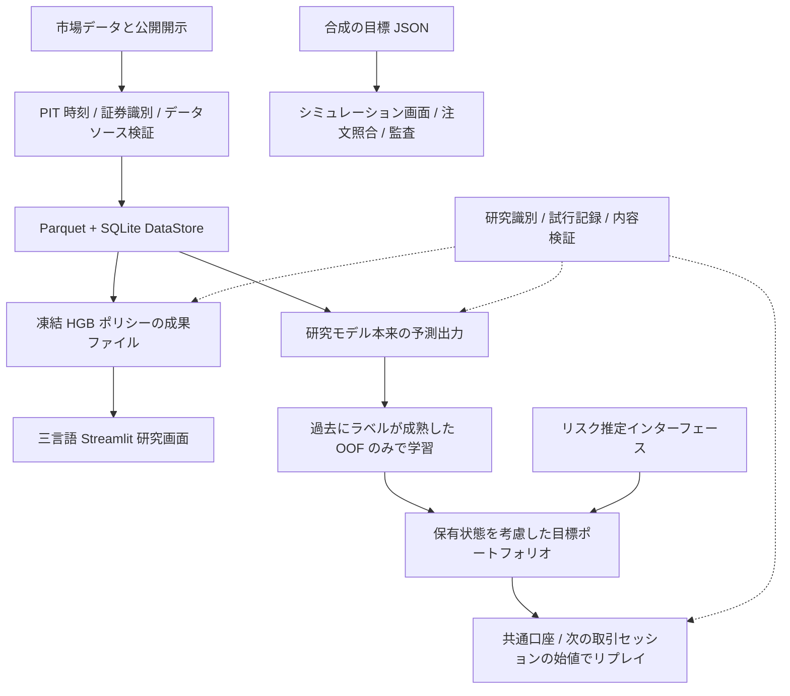

# US Tech Quant v21

**米国株を対象とした、定量研究とシミュレーション実行のエンジニアリングプロジェクト。**
情報が利用可能になる時刻を軸に、データ、予測、ポートフォリオ、デモを構成し、データソース、時間の境界、判断の記録を保持します。

[English](../README.md) · [中文](README.zh.md) · [日本語](README.ja.md)

[概要](#overview) · [アーキテクチャ](#architecture) · [技術設計](#engineering) · [研究体系](#research) · [デモの実行](#quickstart) · [検証](#verification) · [ソースコード案内](#navigation)

> **今回の検証：** 2026-10-01、合成データを使った既定の回帰テストで **203 passed**。これは指定したエンジニアリングテスト群の結果であり、戦略の有効性や実取引への準備が整っていることを証明するものではありません。完全なデータ、モデルファイル、研究用の台帳はリポジトリ外に保存しています。公開ソースには、合成データで動作するシミュレーション用のワークスペースが含まれます。

<a id="overview"></a>
## 概要

定量研究の難しさはモデルだけにあるわけではありません。開示書類がいつ公開されたか、過去の証券識別が正しいか、予測値が何を意味するか、既存の保有銘柄を実際に売買できるか、失敗した試行を後から再構成できるか。その周囲にある情報と実行の流れも設計する必要があります。

PIT（point-in-time）は、意思決定時点で利用可能だった情報から入力を再構成する考え方です。OOF（out-of-fold）は、時間順に生成する学習フォールド外の予測です。各行を予測するモデルの学習と選択には、その行のラベルや将来の情報を使いません。HGB はヒストグラムベースの勾配ブースティングモデルです。

本プロジェクトは、こうした課題に対して次の三つの機能を実装しています。

| 機能 | 実装内容 | 確認できるもの |
| --- | --- | --- |
| **データと PIT** | Parquet / SQLite によるカタログ、データソースと価格の定義、13F の公開時刻と証券識別 | データの識別情報、利用可能時刻のタイムスタンプ、データ系譜、拒否理由 |
| **研究とポートフォリオ** | モデル本来の予測出力、ラベルが成熟した OOF 記録で学習したブリッジ、リスク行列、保有状態を考慮したポートフォリオ、共通口座でのリプレイ | 凍結したパラメータ、目標ウェイト、コスト、口座の制約 |
| **可視化とシミュレーション** | 三言語の Streamlit 研究画面、標準ライブラリによるシミュレーション画面、注文の照合と監査 | 判断の流れ、保有数量と目標の差分、注文状態、実行記録 |

公開プロジェクト名は **v21** を維持しています。ソース内の `V22`、`A2`、`FAST3` は、それぞれ内部パイプラインや研究系列の識別子です。研究実装、現在の表示用ポリシー、シミュレーション実行コンポーネントは状態が異なるため、ファイル名だけでモデルが採用済みと判断することはできません。

<a id="architecture"></a>
## アーキテクチャ



この図は各モジュールの責務を示しています。**凍結 HGB の表示パイプラインと JOINT の研究パイプラインは別々に管理しています。** 共通口座のリプレイは研究用の価格指数単位を使い、シミュレーション画面は独立した状態と注文ライフサイクルを持ちます。

| レイヤー | 技術 | 設計上の重点 |
| --- | --- | --- |
| データ | Python、Pandas、NumPy、PyArrow、Parquet、SQLite | データソース、価格調整の定義、vintage、lineage の区別 |
| モデル | scikit-learn、任意の boosting・PyTorch 研究実装 | リターン、確率、順位、分位点などの元の意味を保持 |
| 研究管理 | JSON、SHA-256、不変スナップショット、イベントのハッシュチェーン | 研究識別の重複確認、凍結検証、失敗した試行、受け入れ状態 |
| 可視化 | Streamlit、Altair、中国語 / 日本語 / 英語 | 公開済みファイルを読み、日付、欠損、判断の流れを表示 |
| シミュレーションとサービス | Python 標準ライブラリ、HTML / CSS / JavaScript、SQLite WAL、PowerShell | ファイルロック、状態の永続化、注文照合、プロセスの所有権 |

ソース、テスト、小規模な設定はリポジトリに保存します。データ、環境、キャッシュ、実験、レポート、日次状態は、[共通パス設定](../config/storage_paths.json)と[統一リゾルバー](../scripts/common/storage_paths.py)を通して、互いに入れ子にならない外部のルートディレクトリへ振り分けます。詳細は[ストレージの説明](STORAGE_LAYOUT.md)を参照してください。

<a id="engineering"></a>
## 深掘りできる三つの技術設計

### 1. 13F は報告四半期ではなく、利用可能時刻に基づいて再構築する

[13F の PIT 再構築](../scripts/v22/pit_13f_reconstruction_r1.py)は、SEC が実際に受理した時刻、ニューヨーク時間の判断締切、修正申告の意味、過去の証券識別に基づいて、利用可能な申告を選びます。`security_id` / CUSIP と ticker は役割が異なり、ticker だけでは過去の証券が同一であることを確認できません。機関投資家の一覧は四半期ごとの適用期間で解決し、その処理は[13F 更新モジュール](../scripts/storage/refresh_13f_quarter.py)にあります。

以下は**合成の説明例**であり、研究で観測した結果ではありません。

| 状況 | 判断に利用できるか | 理由 |
| --- | --- | --- |
| 2025-11-12 10:20 に公開され、当日の判断締切が 09:45（いずれもニューヨーク時間） | 利用不可 | 判断後に公開された情報であるため |
| 同じ申告を次の取引日の 09:45 の判断に使う | 後続の確認へ進める | 公開時刻は締切を満たすが、証券識別、修正、適格性も有効である必要がある |
| ticker しかなく、信頼できる過去の識別情報がない | 依存する計算を拒否 | 証券の対応関係を推測で補うことはできない |

**設計上の選択：** 現在の対応表や後日の開示で過去を埋めるのではなく、必要な証拠が欠けている理由を示します。

### 2. モデル予測から目標ポートフォリオへの変換で、意味を保持する

確率、銘柄間の順位、リターン予測、分位点を、そのまま同じ種類のウェイトとして扱うことはできません。[ブリッジ（予測出力の変換）](../scripts/research/a2/ensemble/joint_oof_bridge.py)は元の予測座標を保持し、**意思決定時点より前にラベルが成熟した OOF 記録**だけを使って標準化と Ridge による変換を学習します。各日付の合計ウェイトを等しくし、候補銘柄の多い日付が他の日付を圧倒しないようにしています。

凍結後の推論は既存のパラメータを適用するだけです。対応する[テスト定義](../tests/research/a2/ensemble/test_joint_oof_bridge.py)では、ラベル成熟時刻の締切、元の予測座標の保持、将来の記録を追加しても過去の学習結果が変わらないことを確認します。

**設計上の選択：** モデルを追加しても、時刻の境界と予測の意味は同じインターフェースで制約します。統計アルゴリズムは既存ライブラリを利用し、本プロジェクトでは情報の境界とインターフェースの組み合わせに重点を置いています。

### 3. 売買できない保有ポジションも制約に含める

[ポートフォリオ方針](../scripts/research/a2/inference/joint_portfolio_policy.py)は、売買が制限された保有ポジションに資金と銘柄枠を確保します。予測の欠損、リスク入力の不足、実行不可能な目標に遭遇した場合は実際の保有単位を維持し、リプレイの中で暗黙に現金を作り出したり、ポジションを決済したりしません。

対応する[テスト定義](../tests/research/a2/inference/test_joint_portfolio_policy.py)は、既存ポジションの枠確保、実行不可能なポートフォリオ、ウェイト上限を対象としています。保有銘柄数の制約には決定論的な近似解法を使っており、**大域的な最適性は保証していません。**

**設計上の選択：** 新しい候補のスコアが高くても、口座内でまだ売買できない保有ポジションを消すことはできません。

<a id="research"></a>
## 研究体系と現在の状態

研究インターフェースは Alpha、Risk、Portfolio、口座リプレイを分離しています。モデル名の数は有効な戦略の数を意味しません。現在の表示用ポリシー、探索的研究、実データによる確認的評価は、それぞれ別に説明する必要があります。

| コンポーネント | 現在説明できる機能 | 明示すべき制約 |
| --- | --- | --- |
| **HGB の表示用ポリシー** | 凍結スコアラーと `HGB_DIAG_5` / `HGB_FACTOR_5` の成果出力アダプター。読み込み前に内容の識別情報を検証 | 二つのポリシーは証拠へのアクセス後にユーザーが選択したもので、独立テストで自動選択された最適戦略ではない |
| **JOINT 研究インターフェース** | 元の予測出力 → ラベルが成熟した OOF で学習したブリッジ → リスクとポートフォリオ → 次の取引セッションの始値での口座リプレイ | インターフェースとリプレイの実装は、モデルの採用や収益性の証明を意味しない |
| **モデル探索** | 線形モデル、HGB、RF / ExtraTrees。XGBoost / LightGBM / CatBoost、MLP、一部の時系列ネットワーク | 拡張依存関係はタスクごとに導入し、各モデルの受け入れ状態は個別に判断する |
| **リスク推定** | DIAG、標本共分散、Ledoit–Wolf / OAS、因子モデル、その他の研究用推定インターフェース | 期間、単位、データソースの整合が必要。非線形収縮の依存関係は現在ブロック中 |
| **FAST3** | 既存の研究アーキテクチャ、契約、合成データによる検証 | 現在は synthetic-only。凍結した Confirmation は通常の開発で読む対象ではない |
| **シミュレーション実行** | paper / 証券会社のシミュレーション環境、注文照合、永続化した監査記録 | 実取引インターフェースは読み取りに限定。エンジニアリング検証の通過は実取引や収益性の認定ではない |

研究の識別情報は[既存レジストリ](../scripts/maintenance/research_registry.py)が管理し、[ライフサイクルモジュール](../scripts/maintenance/prospective_research_lifecycle.py)が試行、停止理由、再開条件を保存します。照会には現在のソースと[廃止ソースの索引](research/retired_sources.json)を併用し、名前の変更による研究の重複を防ぎます。

**情報の境界：**

- 学習と開発用検証は **2026-01-01 より前**に限定します。前処理、特徴量選択、ハイパーパラメータ調整、校正、ルール選択も選択過程に含み、より早い fold の締切とラベル成熟の境界にも従います。
- 2026 年のテスト観測と目的変数の対象期間は **[2026-01-01, 2027-01-01)** に限定します。適用される許可の範囲で凍結済み状態を使い、学習状態は更新しません。評価するのは、評価時点ですでに発生し、ラベルが成熟した部分だけです。
- A2 の 2026 年の証拠にはすでにアクセスしているため、未見の独立ホールドアウトと呼び直すことはできません。2027 年以降は、別途定める将来評価の対象です。
- この README はエンジニアリングと研究設計を説明します。収益、Sharpe、ベンチマークを上回る成績、全入力の完全な PIT 検証を主張するものではありません。具体的な状態は、適用される契約と受け入れ記録に従います。

<a id="quickstart"></a>
## デモの実行

### A. 公開ソース：合成データのシミュレーション画面

**必要環境：** Windows、PowerShell、Python 3.12（`python` コマンドが使用できること）。この手動シミュレーション用エントリーポイントは標準ライブラリを使い、Streamlit、Moomoo SDK、OpenD、外部の研究データを必要としません。

以下のコマンドは専用の PowerShell ウィンドウで実行し、終了後はそのウィンドウを閉じてください。デモ B は既存のプロジェクト環境で実行し、ここで設定する `USTQ_DAILY_ROOT` の上書きを引き継がないようにします。

```powershell
git clone https://github.com/kinryukii/us-tech-quant-v21.git
Set-Location us-tech-quant-v21

# 毎回、リポジトリ外に独立した状態ディレクトリを作ります。
$env:USTQ_DAILY_ROOT = Join-Path $env:LOCALAPPDATA 'US Tech Quant\demo-daily'
$demoState = Join-Path $env:USTQ_DAILY_ROOT ('paper-' + [guid]::NewGuid().ToString('N'))
python -B -m apps.moomoo_trading_component.moomoo_component `
  --repo-root $PWD.Path --data-dir $demoState --port 8766
```

このワークスペースのボタンは現在中国語表示です。<http://127.0.0.1:8766/> を開き、**「载入离线演示」（オフラインデモの読み込み）→「预览订单与风控」（注文とリスクチェックのプレビュー）→ 資金・気配値・注文差分の確認 →「执行一轮」（一度実行）→ 保有ポジションと監査記録の確認**の順に操作します。例では合成の目標と価格を使います。デモ中は手動 paper モードを維持し、証券会社との接続へ切り替えないでください。ターミナルで `Ctrl+C` を押すと停止します。

このエントリーポイントでは、目標をどのように確認可能なシミュレーション注文へ変換するかを示します。研究リプレイとは用途も実行の意味も異なります。既存のローカル環境では `apps/moomoo_trading_component/start.ps1 -Offline` も利用できますが、既定で `daily_root/moomoo_trading_component/manual` を再利用するため、保持すべき状態がないか先に確認してください。

### B. 設定済みのローカル環境：三言語の研究画面

```powershell
# 既存の正式リポジトリから実行します。
# 外部の demo-console 環境と公開済み研究ファイルが必要です。
Set-Location D:\us-tech-quant
powershell -NoProfile -ExecutionPolicy Bypass `
  -File .\apps\demo_console\start.ps1 -Port 8504
```

<http://127.0.0.1:8504/> を開き、**システム概要 → モデルとポリシー → 判断とポートフォリオ → パフォーマンスとリスク → 研究の証拠**の順に説明できます。画面は三言語の切り替えと個別銘柄の履歴照会に対応しています。実際の研究内容を読む場合も、適用される許可の範囲に従います。

`requirements.lock.txt` は基礎環境のスナップショットであり、全プロジェクトの依存関係を一括導入するための一覧ではありません。[研究画面の依存関係](../apps/demo_console/requirements.txt)と[任意の証券会社接続用依存関係](../apps/moomoo_trading_component/requirements-moomoo.txt)は別々に管理し、モデル探索にも対応する依存関係があります。完全な研究データ、凍結モデル、台帳はリポジトリに同梱していません。

<a id="verification"></a>
## 検証と再現

**記録済みのエンジニアリング基準：203 passed、2026-10-01。** 設定済みのローカルリポジトリで既定のテスト群を再現します。

```powershell
Set-Location D:\us-tech-quant
$projectPython = 'D:\us-tech-quant-envs\us-tech-quant-main\Scripts\python.exe'
$cacheRoot = (& $projectPython -B -c "from scripts.common.storage_paths import resolve; print(resolve().cache_root)").Trim()
$verificationRoot = Join-Path $cacheRoot ('_maintenance\readme-verification-' + [guid]::NewGuid().ToString('N'))
$pytestTemp = Join-Path $verificationRoot 'tmp'
$pytestCache = Join-Path $verificationRoot 'pytest-cache'
& $projectPython -B -m pytest -q --basetemp $pytestTemp -o "cache_dir=$pytestCache"
```

[pytest.ini](../pytest.ini)には、既定で実行するテストファイルを個別に列挙しています。ストレージ、カタログとデータソースの確認、保守、サービスライフサイクルの合成シナリオを対象としています。上記のコマンドは、解決した外部 `cache_root` の実行ごとに独立したディレクトリへ、一時データと pytest キャッシュを明示的に書き込みます。

| 検証レイヤー | この README が示す証拠の範囲 |
| --- | --- |
| 既定のエンジニアリング回帰テスト | 2026-10-01 に実際に実行し、203 件が通過。リポジトリ全体のテストカバレッジではない |
| オフラインのシミュレーションフロー | Python 3.12.10 と新しい `daily_root` サブディレクトリで確認。ヘルスチェック、ホームページ、状態取得の各エンドポイントが HTTP 200 を返し、合成デモの読み込み、注文とリスクのプレビュー、paper モードでの 1 回の実行が通過。実際の研究結果は読み込まず、証券会社には接続せず、証券会社 API の呼び出しは 0 回 |
| 個別の研究設計 | ソースとテスト定義へのリンクを提供。過去の研究や実データを使う追加テストは自動実行しない |
| 戦略の効果と汎化 | 適用可能なデータ、凍結契約、失敗した試行、適用される許可の範囲での評価が必要。エンジニアリングテストだけからは結論づけられない |
| 証券会社とのエンドツーエンド検証と実取引 | 今回は未検証。paper 状態やシミュレーション約定は実際の執行証拠を代替しない |

<a id="navigation"></a>
## ソースコード案内

| 知りたいこと | 参照先 |
| --- | --- |
| プロジェクトの入口と状態のルール | [プロジェクトマップ](PROJECT_MAP.md)、[ドキュメント一覧](README.md) |
| データとストレージ | [DataStore](../scripts/storage/storage_r2a.py)、[データレイヤーの説明](DATA_LAYER.md) |
| 13F の Point-in-Time 処理 | [PIT 再構築](../scripts/v22/pit_13f_reconstruction_r1.py) |
| 現在の凍結 HGB 成果出力パイプライン | [selected_hgb.py](../scripts/research/a2/portfolio/selected_hgb.py) |
| 元の予測出力、リスク、ポートフォリオ | [OOF 変換](../scripts/research/a2/ensemble/joint_oof_bridge.py)、[リスク推定](../scripts/research/a2/risk/joint_risk_estimators.py)、[ポートフォリオ方針](../scripts/research/a2/inference/joint_portfolio_policy.py) |
| 研究識別と失敗記録 | [レジストリ](../scripts/maintenance/research_registry.py)、[ライフサイクル](../scripts/maintenance/prospective_research_lifecycle.py) |
| 可視化とシミュレーション注文 | [研究画面](../apps/demo_console/)、[シミュレーション画面](../apps/moomoo_trading_component/) |
| 開発規約と保持ルール | [AGENTS.md](../AGENTS.md)、[リポジトリ構成](governance/REPOSITORY_LAYOUT.md)、[Anti-Bloat](governance/ANTI_BLOAT_POLICY.md) |
