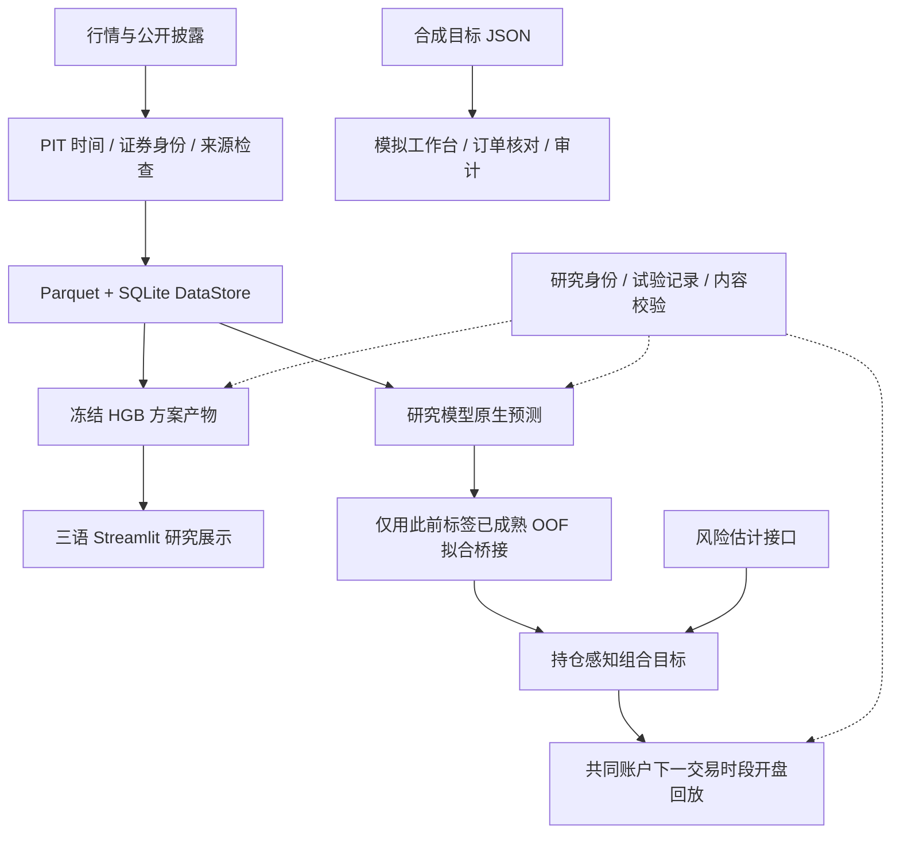

# US Tech Quant v21

**面向美股的量化研究与模拟执行工程项目。**
围绕信息可得时间组织数据、预测、组合与演示，并保留来源、时间边界和决策记录。

[English](../README.md) · [中文](README.zh.md) · [日本語](README.ja.md)

[项目概览](#overview) · [架构](#architecture) · [技术设计](#engineering) · [研究体系](#research) · [运行演示](#quickstart) · [验证](#verification) · [源码导航](#navigation)

> **当前验证：** 2026-10-01，默认合成回归 **203 passed**。这是指定工程测试集的结果，不能证明策略有效或已具备实盘运行条件。完整数据、模型文件和研究账本位于仓库之外；公开源码包含一个可用合成数据运行的模拟工作台。

<a id="overview"></a>
## 项目概览

量化项目的难点不仅在于模型，还在于模型周围的信息与执行链：申报文件何时公开、历史证券身份是否正确、预测值究竟代表什么、已有持仓能否交易，以及一次失败试验能否被复盘。

PIT（point-in-time）指按决策时实际可得信息重建输入；OOF（out-of-fold）指按时间顺序生成的折外预测：生成该行预测的模型在拟合和选择时，不使用该行标签或未来信息。HGB 是直方图梯度提升模型。

这个项目围绕这些问题实现了三类能力：

| 能力 | 具体实现 | 可检查的输出 |
| --- | --- | --- |
| **数据与 PIT** | Parquet / SQLite 目录、来源与价格口径、13F 披露时间与证券身份 | 数据身份、信息可得时间戳、血缘和拒绝原因 |
| **研究与组合** | 模型原生预测、使用标签已成熟 OOF 记录拟合的桥接、风险矩阵、持仓感知组合、共同账户回放 | 冻结参数、目标权重、成本与账户约束 |
| **展示与模拟** | 三语 Streamlit 研究界面、标准库模拟工作台、订单核对与审计 | 决策链、持仓差额、订单状态与运行记录 |

项目公开名称保留 **v21**；源码中的 `V22`、`A2` 和 `FAST3` 分别是内部管线与研究系列标识。研究实现、当前展示方案和模拟执行组件具有不同状态，不能仅凭文件名认定某个模型已被采纳。

<a id="architecture"></a>
## 架构



图中展示的是模块职责。**冻结 HGB 展示链与 JOINT 研究链分开维护**；共同账户回放使用研究价格指数单位，模拟工作台有独立的状态与订单生命周期。

| 层 | 技术 | 设计重点 |
| --- | --- | --- |
| 数据 | Python、Pandas、NumPy、PyArrow、Parquet、SQLite | 区分来源、复权口径、vintage 与 lineage |
| 模型 | scikit-learn；可选 boosting 与 PyTorch 研究实现 | 保留回报、概率、排名、分位数等原始语义 |
| 研究控制 | JSON、SHA-256、不可变快照与事件哈希链 | 身份查重、冻结校验、失败试验与接受状态 |
| 展示 | Streamlit、Altair、中文 / 日文 / 英文 | 从已发布文件读取，展示日期、缺口和决策链 |
| 模拟与服务 | Python 标准库、HTML / CSS / JavaScript、SQLite WAL、PowerShell | 文件锁、状态持久化、订单核对与进程所有权 |

源码、测试和小配置保存在仓库；数据、环境、缓存、实验、报告和日常状态由[共享路径配置](../config/storage_paths.json)与[统一解析器](../scripts/common/storage_paths.py)路由到互不嵌套的外部根。详见[存储说明](STORAGE_LAYOUT.md)。

<a id="engineering"></a>
## 三个值得深入看的技术设计

### 1. 13F 按公开时间重建，而不是按季度提前使用

[13F PIT 重建](../scripts/v22/pit_13f_reconstruction_r1.py)依据 SEC 实际接受时间、纽约决策截止、修订语义和历史证券身份选择可用申报。`security_id` / CUSIP 与 ticker 有不同职责；仅凭 ticker 不能证明历史身份一致。机构名单按季度生效区间解析，相关逻辑位于[13F 刷新模块](../scripts/storage/refresh_13f_quarter.py)。

下面是**合成说明**，不是研究观测：

| 情况 | 是否可用于决策 | 原因 |
| --- | --- | --- |
| 2025-11-12 10:20 公开，决策截止为当天 09:45（两者均为纽约时间） | 否 | 披露发生在决策之后 |
| 同一申报用于下一交易日 09:45 的决策 | 可以进入后续检查 | 公开时间满足截止；身份、修订和资格仍须有效 |
| 只有 ticker，缺少可靠历史身份 | 拒绝依赖计算 | 不能补造证券映射 |

**取舍：** 宁愿给出缺失证据的原因，也不以今天的映射或后来的披露补齐过去。

### 2. 模型预测与组合目标之间保留语义

概率、横截面排名、回报预测和分位数不能直接当作同一类权重。[原生预测桥接](../scripts/research/a2/ensemble/joint_oof_bridge.py)先保留预测坐标，再用**决策之前标签已成熟的 OOF 记录**拟合标准化与 Ridge 桥接；每个日期总权重相等，避免候选较多的日期压倒其他日期。

冻结后的推断只应用既有参数。对应[测试定义](../tests/research/a2/ensemble/test_joint_oof_bridge.py)覆盖标签成熟截止、原始坐标保留，以及追加未来记录不改变较早拟合的检查。

**取舍：** 模型可以扩展，时间边界和预测含义仍由同一接口约束。这里的统计算法来自既有库，项目工作集中在信息边界与接口组合。

### 3. 不可交易持仓进入组合约束

[组合策略](../scripts/research/a2/inference/joint_portfolio_policy.py)给锁定持仓预留资金和名额；遇到缺失预测、风险输入不足或不可行目标时保留实际单位，避免在回放中凭空生成现金或清仓。

其[测试定义](../tests/research/a2/inference/test_joint_portfolio_policy.py)覆盖预留持仓、不可行组合与权重上限。持仓数量约束采用确定性近似求解，**没有全局最优保证**。

**取舍：** 一个分数更高的新候选，不能自动抹去账户中尚无法交易的持仓。

<a id="research"></a>
## 研究体系与当前状态

研究接口将 Alpha、Risk、Portfolio 和账户回放分层。模型名称的数量不代表有效策略数量；当前展示方案、研究探索和真实数据确认性评价必须分别说明。

| 组件 | 当前可以说明的能力 | 应保留的限制 |
| --- | --- | --- |
| **HGB 展示方案** | 冻结评分器与 `HGB_DIAG_5` / `HGB_FACTOR_5` 发布适配器；加载前校验内容身份 | 两种方案由用户在证据暴露后选定，不是独立测试自动选出的最优策略 |
| **JOINT 研究接口** | 原生预测 → 基于标签已成熟 OOF 拟合的桥接 → 风险与组合 → 下一交易时段开盘账户回放 | 接口和回放实现不等于模型已被采用或已证明盈利 |
| **模型探索** | 线性模型、HGB、RF / ExtraTrees；XGBoost / LightGBM / CatBoost、MLP 与部分时序网络 | 扩展依赖按任务安装，各模型的接受状态独立判断 |
| **风险估计** | DIAG、样本协方差、Ledoit–Wolf / OAS、因子与其他研究估计接口 | 期限、单位和来源要匹配；非线性收缩依赖当前标记为阻塞 |
| **FAST3** | 既有研究架构、契约与合成验证 | 当前为 synthetic-only；冻结 Confirmation 不作为普通开发读取目标 |
| **模拟执行** | paper / 券商模拟模式、订单核对与持久化审计 | 实盘接口限定为读取；工程通过不构成实盘或收益认证 |

研究身份由[现有注册表](../scripts/maintenance/research_registry.py)管理；[生命周期模块](../scripts/maintenance/prospective_research_lifecycle.py)保存试验、停止原因和重开条件。查询同时利用现有源码与[退役源码索引](research/retired_sources.json)，避免用改名重复既有研究。

**信息边界：**

- 训练与开发验证严格早于 **2026-01-01**；预处理、特征选择、调参、校准和规则选择同样属于选择过程，且服从更早的 fold 与标签成熟边界。
- 2026 测试观测与目标限定在 **[2026-01-01, 2027-01-01)**。只能在适用授权下应用已冻结状态，不更新拟合；只评价当时已发生且标签成熟的部分。
- A2 的 2026 证据已有暴露，不能重新称为未见的独立留出集。2027 年及以后属于另行约定的前瞻评价。
- 本 README 展示工程和研究设计，不据此宣称收益、Sharpe、优于基准或所有输入已通过完整 PIT 认证。具体状态以适用契约和接受记录为准。

<a id="quickstart"></a>
## 运行演示

### A. 公开源码：合成数据模拟工作台

**需求：** Windows、PowerShell、Python 3.12（`python` 命令可用）。该手动模拟入口使用标准库，无需 Streamlit、Moomoo SDK、OpenD 或外部研究数据。

在独立 PowerShell 窗口运行以下命令，结束后关闭该窗口。再演示 B 时使用现有项目环境，避免继承本段的 `USTQ_DAILY_ROOT` 覆盖。

```powershell
git clone https://github.com/kinryukii/us-tech-quant-v21.git
Set-Location us-tech-quant-v21

# 每次生成独立状态目录，位于仓库之外。
$env:USTQ_DAILY_ROOT = Join-Path $env:LOCALAPPDATA 'US Tech Quant\demo-daily'
$demoState = Join-Path $env:USTQ_DAILY_ROOT ('paper-' + [guid]::NewGuid().ToString('N'))
python -B -m apps.moomoo_trading_component.moomoo_component `
  --repo-root $PWD.Path --data-dir $demoState --port 8766
```

工作台当前使用中文按钮标签。打开 <http://127.0.0.1:8766/>，依次操作：**载入离线演示 → 预览订单与风控 → 检查资金、报价与订单差额 → 执行一轮 → 查看持仓与审计**。示例使用合成目标和价格；演示时保持手动 paper 模式，不切换券商连接。终端中按 `Ctrl+C` 停止。

这个入口展示“目标如何变成可核对的模拟订单”。它与研究回放是两套不同用途的执行语义。已有本机环境也可使用 `apps/moomoo_trading_component/start.ps1 -Offline`，但该脚本默认复用 `daily_root/moomoo_trading_component/manual`，应先确认没有已有状态需要保留。

### B. 配置完整的本机：三语研究界面

```powershell
# 从现有权威仓库执行。
# 需要外部 demo-console 环境与已发布研究文件。
Set-Location D:\us-tech-quant
powershell -NoProfile -ExecutionPolicy Bypass `
  -File .\apps\demo_console\start.ps1 -Port 8504
```

打开 <http://127.0.0.1:8504/>，沿着**系统概览 → 模型与方案 → 决策与组合 → 表现与风险 → 研究证据**展示。界面支持三语切换和个股历史查询。真实研究内容的读取仍受适用授权限制。

`requirements.lock.txt` 是基础环境快照，不是全项目的一键依赖清单。[研究界面依赖](../apps/demo_console/requirements.txt)和[可选券商依赖](../apps/moomoo_trading_component/requirements-moomoo.txt)分开管理；模型探索另有相应依赖。完整研究数据、冻结模型与账本没有随仓库分发。

<a id="verification"></a>
## 验证与复现

**已记录的工程基线：203 passed，2026-10-01。** 在配置完整的本机仓库复现默认测试集：

```powershell
Set-Location D:\us-tech-quant
$projectPython = 'D:\us-tech-quant-envs\us-tech-quant-main\Scripts\python.exe'
$cacheRoot = (& $projectPython -B -c "from scripts.common.storage_paths import resolve; print(resolve().cache_root)").Trim()
$verificationRoot = Join-Path $cacheRoot ('_maintenance\readme-verification-' + [guid]::NewGuid().ToString('N'))
$pytestTemp = Join-Path $verificationRoot 'tmp'
$pytestCache = Join-Path $verificationRoot 'pytest-cache'
& $projectPython -B -m pytest -q --basetemp $pytestTemp -o "cache_dir=$pytestCache"
```

[pytest.ini](../pytest.ini)列出精确的默认测试文件，覆盖存储、目录与来源检查、维护及服务生命周期的合成场景。上述命令显式将临时数据与 pytest 缓存写入解析后的外部 `cache_root`，每次运行使用独立目录。

| 验证层 | 本 README 的证据范围 |
| --- | --- |
| 默认工程回归 | 2026-10-01 实际运行，203 项通过；不是全仓库测试覆盖率 |
| 离线模拟流程 | 使用 Python 3.12.10 和全新的 `daily_root` 子目录验证：健康检查、首页和状态接口均返回 HTTP 200；合成演示载入、订单与风控预览及一轮 paper 执行通过。未读取真实研究结果，未连接券商，券商调用为零 |
| 专项研究设计 | 提供源码与测试定义链接；不自动运行历史研究或扩展真实数据测试 |
| 策略效果与泛化 | 需要适用数据、冻结契约、失败试验与获适用授权的评价；不能由工程测试推出 |
| 券商端到端与实盘 | 本次未验证；paper 状态和模拟成交不能替代真实执行证据 |

<a id="navigation"></a>
## 源码导航

| 想了解什么 | 从这里开始 |
| --- | --- |
| 项目入口与状态规则 | [项目地图](PROJECT_MAP.md)、[文档目录](README.md) |
| 数据与存储 | [DataStore](../scripts/storage/storage_r2a.py)、[数据层说明](DATA_LAYER.md) |
| 13F 的点时逻辑 | [PIT 重建](../scripts/v22/pit_13f_reconstruction_r1.py) |
| 当前冻结 HGB 发布链 | [selected_hgb.py](../scripts/research/a2/portfolio/selected_hgb.py) |
| 原生预测、风险与组合 | [OOF 桥接](../scripts/research/a2/ensemble/joint_oof_bridge.py)、[风险估计](../scripts/research/a2/risk/joint_risk_estimators.py)、[组合策略](../scripts/research/a2/inference/joint_portfolio_policy.py) |
| 研究身份与失败记录 | [注册表](../scripts/maintenance/research_registry.py)、[生命周期](../scripts/maintenance/prospective_research_lifecycle.py) |
| 展示与模拟订单 | [研究界面](../apps/demo_console/)、[模拟工作台](../apps/moomoo_trading_component/) |
| 开发约定与保留规则 | [AGENTS.md](../AGENTS.md)、[仓库布局](governance/REPOSITORY_LAYOUT.md)、[Anti-Bloat](governance/ANTI_BLOAT_POLICY.md) |
