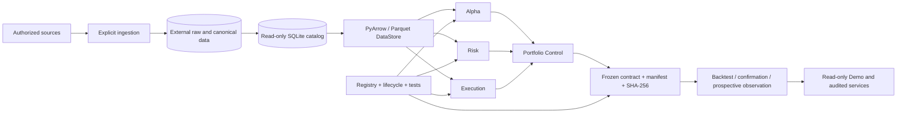

# US Tech Quant v21

### An evidence-first, point-in-time quantitative research operating system for US equities

**不是只生成回测结果，而是证明：在当时可获得的信息下，系统为什么做出这个判断。**<br>
**Not just a backtest engine, but a system that can prove why a decision was valid with the information available at that time.**<br>
**単なるバックテストではなく、その時点で利用可能だった情報から、なぜその判断が成立したかを証明するシステムです。**

[中文](#中文) · [English](#english) · [日本語](#日本語) · [Technical evidence](#technical-evidence)

> **Research only.** Live trading is not authorized. Model promotion, provider access, and operational execution remain explicit, separately controlled actions.

## Why this system is technically different

| | Typical research repository | US Tech Quant v21 |
| --- | --- | --- |
| Time correctness | Split by calendar date | Tracks event time, disclosure availability, data vintage, session, and label maturity |
| Reproducibility | Depends on filenames and “latest” files | Binds paths, manifests, model/config identities, and SHA-256 |
| Experiment discipline | Winners survive; failed trials disappear | Registers research identity and preserves negative, null, and untestable outcomes |
| Model governance | One score drives everything | Separates Alpha, Risk, Execution, and Portfolio Control with independent registries |
| Data behavior | Providers and adjustments may mix silently | Provider and `raw`/`qfq` basis are explicit; canonical reads do not silently fall back |
| Operations | Errors become warnings or stale “healthy” state | Fails closed with ownership checks, degraded latches, atomic state, and controlled restart |
| Presentation | Dashboard recomputes and decorates results | Read-only evidence console preserves original ranks, gaps, costs, dates, and limitations |

The advantage is not a claim that every model wins. The advantage is that **a result is harder to contaminate, easier to reproduce, and clearer to reject when evidence is insufficient**.

**Four constraints that matter:** no automatic model promotion · no silent provider fallback in the canonical reader · `FAST3 confirmation reads = 0` · `LIVE_TRADING_ALLOWED = false`.



## 中文

### 60 秒理解这个系统

US Tech Quant v21 是一套面向美股的量化研究操作系统，而不是单一选股模型。它把以下问题放进同一套可审计架构：

- 数据在历史上的哪个时刻真正可用？
- 某个模型、配置和输入是否与原研究完全一致？
- 一个研究是假设探索、候选冻结、独立确认，还是已经暴露的评估？
- Alpha、风险、执行和组合控制是否使用了各自正确的评价标准？
- 服务异常时，系统是否会停止、降级并保留现场，而不是继续显示“正常”？
- 展示页面显示的是原始证据，还是经过二次包装的新结论？

系统的公开版本名是 **US Tech Quant v21**。`V22.xxx`、`A2` 和 `FAST3` 是内部管线或研究修订标识，不代表项目版本混乱。

### 六项核心技术能力

#### 1. PIT 是完整信息链，不只是日期过滤

系统区分事件日期、披露可用时间、数据库 vintage、复权版本、交易 session 和标签成熟时间。只有“在决策时刻确实可知”的信息才能进入对应 fold。缺少血缘、时区、修订身份或成熟度证据时，依赖计算会失败关闭。

#### 2. 结果由内容身份固定，而不是由文件名固定

研究输入、模型、配置和结果通过路径、角色、manifest 与 SHA-256 绑定。SQLite catalog 中同一 `dataset + ticker + adjustment` 只能有一个 current 文件；路径必须是绝对路径并位于受控外部根目录内。目录中的 “current” 只代表文件选择，不自动代表 PIT 合法或模型已采纳。

#### 3. 研究流程主动防止事后选择

研究身份由经济假设、信息集、目标/周期、机制和评估设计共同确定。确认前冻结候选、数据范围、基准、主要指标、成本、执行和停止条件；查看结果后修改条件会失去原独立确认含义。失败、无增量和不可检验结论与成功结果一样被保存。

#### 4. Alpha、Risk、Execution、Portfolio Control 分层

- **Alpha**：横截面排序和候选选择；原始模型分数不被重新解释为概率、权重或收益。
- **Risk**：坏结果不对称性、beta、行业集中度、HHI、尾部损失和风险预算。
- **Execution**：换手、滞回、成本、持仓转换和执行约束。
- **Portfolio Control**：连接排名、持仓、行业中性、相对价值、风险约束和执行日期。

Alpha、Risk、Execution 分别拥有独立注册表和晋级状态。系统禁止自动晋级；`PROMOTION_ELIGIBLE` 不等于 `PROMOTED_CHAMPION`。

#### 5. 服务控制面按“失败关闭”设计

R1D/R1E 覆盖单实例锁、进程所有权、陈旧锁回收、未知 owner 保护、断连/重连、取消、崩溃重启、幂等停止、原子 JSON 写入和误杀防护。degraded 状态不会自动恢复为 PASS；服务只能终止经过验证的自有 worker。测试使用临时仓库和合成桥接器，不触发真实交易。

#### 6. Demo 展示证据，不重写故事

三语 Streamlit 控制台展示系统概览、机器学习、决策与组合、表现与风险、研究证据。它保留负分、缺失观测、原始排名、成本口径和信息/决策/执行日期，不重新训练、不重排、不补值，也不会把组合回撤包装成单只股票贡献。

### 数据与工程栈

| 层 | 技术与职责 |
| --- | --- |
| 数据访问 | Python, PyArrow, Parquet, SQLite read-only catalog |
| 血缘 | JSON manifests, SHA-256, source role, vintage, immutable input references |
| 研究治理 | Identity registry, candidate freeze, champion–challenger, prospective lifecycle |
| 量化模块 | A2 Alpha/Risk/Execution/Portfolio；FAST3–FAST6 bounded research families |
| 服务 | PowerShell/Windows process control, loopback UI, atomic state, owned-worker lifecycle |
| 展示 | Streamlit 三语只读证据控制台 |
| 验证 | pytest 精确白名单、合成服务测试、PIT/血缘测试、Anti-Bloat gates |

刷新适配器覆盖行情与交易日历、SEC submissions/company facts/13F/财务附注/内部人/N-PORT，以及 BLS、纽约联储、FRB、美国财政部、CFTC、FINRA、BIS、VIX 等研究来源。适配器存在不等于数据完整或已获研究授权；采集、标准化、catalog 注册和研究采纳是四个不同状态。

### 诚实的系统状态

- FAST3 明确记录 `IMPLEMENTATION_VALIDATED_SYNTHETIC_ONLY`、`CONFIRMATION_READ_COUNT=0`、`LIVE_TRADING_ALLOWED=false`。
- 2026+ A2 数据是已暴露的评估证据，不能重新包装成未见留出集或用于调参。
- `ACTIVE`、`FROZEN`、`EVALUATION_ONLY`、`SUPERSEDED`、`EXPERIMENTAL`、`UNKNOWN` 是不同状态。
- 一次测试通过、目录版本较新或回测表现良好，都不能自动改变研究状态。

这套系统的严谨性，体现在它不仅能说明“知道什么”，也能明确说明“还不知道什么”。

### 快速查看

```powershell
Set-Location D:\us-tech-quant

# 只读检查数据目录
& D:\us-tech-quant-envs\us-tech-quant-main\Scripts\python.exe -B -m scripts.storage.manage_data status

# 启动只读 Demo
& .\apps\demo_console\start.ps1 -Port 8504

# 运行经过审阅的默认回归
& D:\us-tech-quant-envs\us-tech-quant-main\Scripts\python.exe -B -m pytest -q
```

Demo：<http://127.0.0.1:8504/?language=%E4%B8%AD%E6%96%87>

---

## English

### Understand the system in 60 seconds

US Tech Quant v21 is a quantitative research operating system for US equities—not a single stock-selection model. It unifies six questions in one auditable architecture:

- What information was genuinely available at the historical decision time?
- Are the model, configuration, inputs, and outputs identical to the original study?
- Is a study exploratory, frozen, independently confirmed, or already exposed evaluation?
- Are Alpha, Risk, Execution, and Portfolio Control judged by the correct domain-specific criteria?
- Does an uncertain service stop, degrade, and preserve evidence instead of remaining “healthy”?
- Is the interface showing original evidence or manufacturing a new narrative?

The public version is **US Tech Quant v21**. `V22.xxx`, `A2`, and `FAST3` are internal pipeline or research revision identifiers.

### Six defining capabilities

#### 1. PIT is an information chain, not a date filter

The system separates event date, disclosure availability, database vintage, adjustment vintage, trading session, and label maturity. Only information genuinely knowable at decision time may enter a fold. Missing lineage, timezone, revision identity, or maturity evidence stops dependent computation.

#### 2. Content identity replaces filename trust

Inputs, models, configurations, and outputs are bound through paths, roles, manifests, and SHA-256. The SQLite catalog permits one current file per `dataset + ticker + adjustment`; paths must be absolute and confined to controlled external roots. Catalog “current” means selected, not automatically PIT-valid or adopted.

#### 3. The lifecycle resists hindsight selection

Research identity combines hypothesis, information set, target/horizon, mechanism, and evaluation design. Candidate, scope, benchmark, primary metric, costs, execution, and stopping conditions freeze before confirmation. A post-outcome change forfeits the original independent-confirmation claim. Negative, non-incremental, and untestable results are preserved.

#### 4. Alpha, Risk, Execution, and Portfolio Control stay separate

- **Alpha** owns cross-sectional ranking and selection; a model score is not reinterpreted as probability, weight, or return.
- **Risk** covers bad-outcome asymmetry, beta, concentration, HHI, tail loss, and risk budgets.
- **Execution** covers turnover, hysteresis, costs, holding transitions, and execution constraints.
- **Portfolio Control** connects ranks, holdings, sector neutrality, relative value, risk constraints, and execution dates.

Alpha, Risk, and Execution have independent registries and promotion states. Automatic promotion is forbidden; `PROMOTION_ELIGIBLE` is not `PROMOTED_CHAMPION`.

#### 5. The service control plane fails closed

R1D/R1E covers single-instance locking, process ownership, stale-lock recovery, unknown-owner protection, disconnect/reconnect, cancellation, crash restart, idempotent stop, atomic JSON state, and unrelated-PID protection. A degraded state never auto-clears to PASS, and only verified owned workers may be terminated. Tests use temporary repositories and synthetic bridges, not real trading.

#### 6. The demo presents evidence instead of rewriting the story

The trilingual Streamlit console covers system overview, machine learning, decisions and portfolio, performance and risk, and research evidence. It preserves negative scores, missing observations, original ordering, costs, and information/decision/execution dates. It does not retrain, rerank, fill gaps, or represent portfolio drawdown as one security's contribution.

### Data and engineering stack

| Layer | Technology and responsibility |
| --- | --- |
| Data access | Python, PyArrow, Parquet, read-only SQLite catalog |
| Lineage | JSON manifests, SHA-256, source roles, vintages, immutable input references |
| Research governance | Identity registry, candidate freeze, champion–challenger, prospective lifecycle |
| Quant modules | A2 Alpha/Risk/Execution/Portfolio; bounded FAST3–FAST6 research families |
| Services | PowerShell/Windows process control, loopback UI, atomic state, owned-worker lifecycle |
| Presentation | Trilingual, read-only Streamlit evidence console |
| Verification | Exact pytest allowlist, synthetic service tests, PIT/lineage tests, Anti-Bloat gates |

Refresh adapters exist for market data and calendars, SEC submissions/company facts/13F/notes/insiders/N-PORT, and research sources including BLS, New York Fed, FRB, US Treasury, CFTC, FINRA, BIS, and VIX. Adapter existence does not imply completeness or authorization: acquisition, normalization, catalog registration, and research adoption are separate states.

### Honest machine-readable status

- FAST3 records `IMPLEMENTATION_VALIDATED_SYNTHETIC_ONLY`, `CONFIRMATION_READ_COUNT=0`, and `LIVE_TRADING_ALLOWED=false`.
- A2 evidence from 2026 onward is already exposed evaluation data and cannot become a pristine holdout or tuning input again.
- `ACTIVE`, `FROZEN`, `EVALUATION_ONLY`, `SUPERSEDED`, `EXPERIMENTAL`, and `UNKNOWN` are distinct states.
- A passing test, newer directory, or attractive backtest cannot change status automatically.

The system's rigor is visible not only in what it claims to know, but in how precisely it records what remains unknown.

### Quick view

```powershell
Set-Location D:\us-tech-quant

# Inspect catalog metadata without acquisition
& D:\us-tech-quant-envs\us-tech-quant-main\Scripts\python.exe -B -m scripts.storage.manage_data status

# Start the read-only demo
& .\apps\demo_console\start.ps1 -Port 8504

# Run the reviewed default regression suite
& D:\us-tech-quant-envs\us-tech-quant-main\Scripts\python.exe -B -m pytest -q
```

Demo: <http://127.0.0.1:8504/?language=English>

---

## 日本語

### 60 秒で理解するシステム

US Tech Quant v21 は単一の銘柄選択モデルではなく、米国株式向けの量的研究オペレーティングシステムです。次の問いを一つの監査可能な構造で扱います。

- 歴史上の判断時点で、本当に利用可能だった情報は何か。
- model、configuration、input、output は元研究と同一か。
- 研究は探索、候補凍結、独立確認、既に公開された評価のどの状態か。
- Alpha、Risk、Execution、Portfolio Control は各領域に適した基準で評価されているか。
- 不確実な障害時に service は停止・縮退・証拠保存を行うか。
- interface は元の証拠を示しているか、新しい物語を生成していないか。

公開バージョンは **US Tech Quant v21** です。`V22.xxx`、`A2`、`FAST3` は内部 pipeline／研究 revision の識別子です。

### システムを定義する六つの能力

#### 1. PIT は日付 filter ではなく情報 chain

event date、開示利用可能時刻、database vintage、adjustment vintage、trading session、label maturity を分離します。判断時点で実際に利用可能だった情報のみ fold に入れます。lineage、timezone、revision identity、maturity の証拠不足時は依存計算を停止します。

#### 2. ファイル名ではなく content identity を信頼

input、model、configuration、output を path、role、manifest、SHA-256 で固定します。SQLite catalog は `dataset + ticker + adjustment` ごとに current file を一つだけ許可し、絶対 path を管理対象の外部 root に限定します。catalog の “current” は選択状態であり、PIT 適格性や採用を自動的に意味しません。

#### 3. 研究 lifecycle が事後選択を防止

研究 identity は仮説、情報集合、target/horizon、mechanism、評価設計で決まります。確認前に candidate、scope、benchmark、primary metric、cost、execution、stopping condition を凍結します。結果閲覧後の変更は元の独立確認主張を失います。否定的、追加価値なし、検証不能の結果も保存します。

#### 4. Alpha・Risk・Execution・Portfolio Control を分離

- **Alpha**：横断ランキングと選択。model score を確率、weight、return に変換しません。
- **Risk**：悪化非対称性、beta、集中度、HHI、tail loss、risk budget。
- **Execution**：turnover、hysteresis、cost、保有遷移、執行制約。
- **Portfolio Control**：rank、holding、sector neutrality、relative value、risk constraint、execution date を接続。

Alpha、Risk、Execution は独立 registry と promotion state を持ちます。自動昇格は禁止され、`PROMOTION_ELIGIBLE` は `PROMOTED_CHAMPION` ではありません。

#### 5. Service control plane は fail closed

R1D/R1E は single-instance lock、process ownership、stale-lock recovery、unknown-owner protection、disconnect/reconnect、cancel、crash restart、idempotent stop、atomic JSON state、unrelated-PID protection を検証します。degraded state は自動で PASS に戻らず、検証済みの自所有 worker のみ停止できます。テストは一時 repository と synthetic bridge を使用し、実取引を行いません。

#### 6. Demo は物語を作らず証拠を提示

三言語 Streamlit console は system overview、machine learning、decisions and portfolio、performance and risk、research evidence を提供します。負 score、欠損観測、元順位、cost、information/decision/execution date を保持します。再学習、再順位付け、欠損補完、単一銘柄への portfolio drawdown 帰属は行いません。

### データとエンジニアリングスタック

| 層 | 技術と責務 |
| --- | --- |
| データアクセス | Python, PyArrow, Parquet, read-only SQLite catalog |
| 系譜 | JSON manifests, SHA-256, source role, vintage, immutable input reference |
| 研究ガバナンス | Identity registry, candidate freeze, champion–challenger, prospective lifecycle |
| Quant module | A2 Alpha/Risk/Execution/Portfolio、FAST3–FAST6 bounded research families |
| Service | PowerShell/Windows process control, loopback UI, atomic state, owned-worker lifecycle |
| 表示 | 三言語・読み取り専用 Streamlit evidence console |
| 検証 | 正確な pytest allowlist、synthetic service tests、PIT/lineage tests、Anti-Bloat gates |

market data/calendar、SEC submissions/company facts/13F/notes/insiders/N-PORT、BLS、NY Fed、FRB、US Treasury、CFTC、FINRA、BIS、VIX などの refresh adapter があります。adapter の存在は完全性や許可を意味しません。acquisition、normalization、catalog registration、research adoption は別々の状態です。

### 正直な machine-readable state

- FAST3 は `IMPLEMENTATION_VALIDATED_SYNTHETIC_ONLY`、`CONFIRMATION_READ_COUNT=0`、`LIVE_TRADING_ALLOWED=false` を記録します。
- 2026 年以降の A2 証拠は既に公開された評価データで、未観測 holdout や tuning input に戻せません。
- `ACTIVE`、`FROZEN`、`EVALUATION_ONLY`、`SUPERSEDED`、`EXPERIMENTAL`、`UNKNOWN` は別状態です。
- test PASS、新しい directory、魅力的な backtest だけでは状態は変わりません。

システムの厳密性は「何を知っているか」だけでなく、「何がまだ不明か」を正確に記録する点にも現れます。

### クイックビュー

```powershell
Set-Location D:\us-tech-quant

# データ取得なしで catalog metadata を確認
& D:\us-tech-quant-envs\us-tech-quant-main\Scripts\python.exe -B -m scripts.storage.manage_data status

# 読み取り専用 Demo を起動
& .\apps\demo_console\start.ps1 -Port 8504

# レビュー済み標準回帰を実行
& D:\us-tech-quant-envs\us-tech-quant-main\Scripts\python.exe -B -m pytest -q
```

Demo: <http://127.0.0.1:8504/?language=%E6%97%A5%E6%9C%AC%E8%AA%9E>

---

## Technical evidence

Claims above are intended to be inspectable rather than promotional.

| Claim | Implementation | Verification / state |
| --- | --- | --- |
| External storage isolation | [`storage_paths.py`](../scripts/common/storage_paths.py) | [`test_storage_paths.py`](../tests/storage/test_storage_paths.py) |
| Read-only catalog and lineage | [`storage_r2a.py`](../scripts/storage/storage_r2a.py) | [`DataStore tests`](../tests/storage/test_data_store.py), [`catalog integration`](../tests/storage/test_catalog_integration.py) |
| Research identity | [`research_registry.py`](../research_registry.py) | [`registry tests`](../test_research_registry.py) |
| Research lifecycle | [`prospective_research_lifecycle.py`](../prospective_research_lifecycle.py) | [`lifecycle tests`](../tests/governance/test_prospective_research_lifecycle.py) |
| Domain-specific governance | [`Alpha`](../config/research_governance/alpha_registry.json), [`Risk`](../config/research_governance/risk_registry.json), [`Execution`](../config/research_governance/execution_registry.json) | Hash-bound identities and explicit transition states |
| Default test boundary | [`pytest.ini`](../pytest.ini) | [`collection isolation`](../scripts/maintenance/test_default_test_collection.py) |
| Windows service hardening | [`R1E tests`](../scripts/v22/test_v22_047_r1e_windows_service_hardening.py) | Real control entrypoints with synthetic workers |
| Read-only evidence UI | [`Demo guide`](../apps/demo_console/README.md) | [`Demo tests`](../apps/demo_console/tests) |
| FAST3 truth state | [`FAST3_STATE.json`](../fast3/state/FAST3_STATE.json) | [`FAST3_STATUS.md`](../fast3/FAST3_STATUS.md) |
| Repository budget and artifact policy | [`Anti-Bloat policy`](../docs/governance/ANTI_BLOAT_POLICY.md) | [`anti_bloat_policy.toml`](../configs/anti_bloat_policy.toml) |

## Repository map

| Path | Role |
| --- | --- |
| `scripts/storage/` | Catalog, readers, manifests, source-specific acquisition adapters |
| `scripts/research/` | Current bounded research implementations |
| `scripts/v21/`, `scripts/v22/` | Current components, compatibility entrypoints, and retained historical modules |
| `apps/demo_console/` | Read-only trilingual evidence console |
| `fast3/`–`fast6/` | Contract- and state-governed research families |
| `tests/` | Synthetic and scoped verification |
| `docs/` | Architecture, storage, data, research, and governance documentation |

Some long root-level files are retained because frozen contracts bind their exact paths or content hashes. They are compatibility surfaces, not the recommended layout for new code. See [`ROOT_AUTHORITY.md`](../ROOT_AUTHORITY.md).

Further reading: [`Project map`](../docs/PROJECT_MAP.md) · [`Data layer`](../docs/DATA_LAYER.md) · [`Storage layout`](../docs/STORAGE_LAYOUT.md) · [`Demo guide`](../apps/demo_console/README.md)

## Disclaimer

This software is intended for quantitative research and audit. It does not provide financial advice, guarantee performance, or authorize broker execution.
